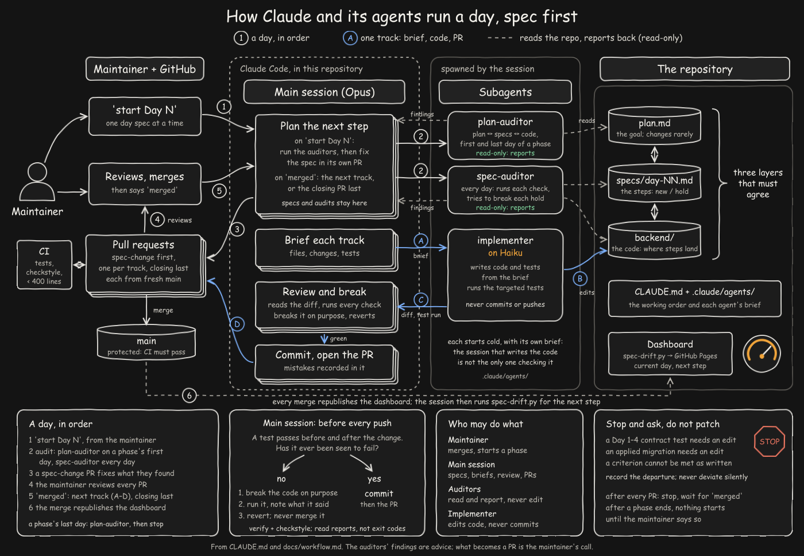
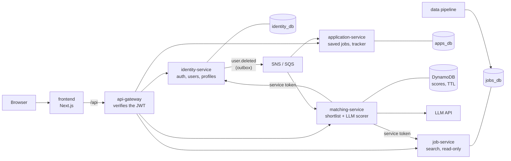

# JobMatch → Microservices

**An experiment in spec-driven, test-first engineering by AI agents: can a working monolith be
migrated to microservices when every change starts as a written specification, every test is
seen to fail before it is trusted, every step passes a ladder of gates, and the agents' own
mistakes are measured instead of hidden?**

This repository takes [JobMatch](docs/original-readme.md) — a deployed, six-person
HackYourFuture final project — and rebuilds it as a set of independently deployable services.
Every change is driven by a numbered day specification with acceptance criteria written *before*
any code exists. The work is done by [Claude](https://www.anthropic.com/claude): Opus 5.5 runs
each day, and since Day 39 an implementer agent on Haiku writes each track's code. I set the plan
and the constraints and approve every change; Claude drafts and audits the specifications.

Days are numbered by their place in the plan, not by date. Days added later took new numbers
and ran where the plan needed them: Days 38–40 before Day 17, Day 41 before Day 21, and Day 42
before Day 32. The [phase table](#the-migration-plan) gives the order they ran in.

> **This repository is an engineering experiment.** Its migration metrics are experimental
> diagnostic signals, not optimization targets or standard measures of quality.

> **Where it stands (Day 33):** Phase 7, ECS on Fargate with Terraform, is under way. The
> monolith is gone; five services run in Docker Compose behind the gateway, and none is deployed
> to AWS yet. See the [known limits](#known-limits).
>
> **Status:** in progress. The [migration dashboard](https://yusuprozimemet.github.io/jobmatch-microservices/) shows the current day
> and the next step; it is rebuilt from the repository after every merge. The full record, day by
> day, is the [lab notebook](docs/lab-notebook.md); the short version is in
> [Findings so far](#findings-so-far).

---

## Table of contents

- [Why this repository exists](#why-this-repository-exists)
- [The system being migrated](#the-system-being-migrated)
- [Method](#method)
- [The migration plan](#the-migration-plan)
- [What runs today, and where it is going](#what-runs-today-and-where-it-is-going)
- [Findings so far](#findings-so-far)
- [Running it](#running-it)
- [Repository layout](#repository-layout)
- [Documentation](#documentation)
- [Credits](#credits)

---

## Why this repository exists

Two goals, deliberately paired because each makes the other harder to fake.

**1. Learn distributed systems by doing the migration, not by reading about it.**
The interesting parts of microservices are not the ones that appear in tutorials. They are the
ones a real codebase forces on you: a session-cookie auth model that cannot survive a stateless
gateway, two SQL joins that reach across a schema boundary that is about to become a network
boundary, and a `ON DELETE CASCADE` that has to become a distributed, eventually-consistent
delete before it stops being GDPR compliance. JobMatch has all four. They are documented as
"the four hard parts" in [`plan.md`](plan.md), and the phase order exists to attack them.

**2. Find out where an LLM agent's competence actually ends on long-horizon engineering work.**
Agents are good at bounded tasks. A monolith migration is the opposite: dozens of days of work
where a mistake on day 8 is discovered on day 20, and where the correct answer is often "do not
build that yet." The hypothesis under test is that the binding constraint is not model
capability but **specification quality** — that an agent given a spec with third-party-checkable
acceptance criteria and a hard review gate produces reviewable, correct work, while the same
agent given a conversational prompt produces plausible work that quietly drifts.

The deliverable is therefore twofold: a migrated system, and an honest record of where the
method held and where it did not. Negative results are recorded in the specs' *Notes* sections
and the [lab notebook](docs/lab-notebook.md) rather than edited out.

## The system being migrated

JobMatch is a job-search application: a daily data pipeline ingests postings, cleans and
deduplicates them and extracts skills and locations; the application lets a user build a skills
profile, search the cleaned set, and see matches ranked 0–100 with an explanation of the score.
It was built by a team of six over a HackYourFuture cohort, deployed, and is documented in full
in the [preserved original README](docs/original-readme.md).

The starting point is a snapshot of `HackYourFutureProjects/c55-final-project-group-C`
at commit `d43a24d`, committed here unmodified as the first commit so that every subsequent
change is visible in the diff.

| Layer | Stack | Migration status |
| --- | --- | --- |
| **Backend** | Java 25, Spring Boot 4.1, Spring Security, PostgreSQL, Flyway, Maven | **The subject of the migration**: now five services |
| **Frontend** | Next.js 16, React 19, TypeScript | Changed only where auth did: refresh on a 401 and retry once (#86); reaches the backend through the gateway since Day 16 |
| **Data** | Python, dbt, Airflow, Databricks, Azure | Unchanged; already owns its own schema |
| **Infrastructure** | Docker Compose, GitHub Actions, GHCR | ECS on Fargate + Terraform in Phase 7 |

Why this codebase is a good subject: it is small enough to migrate (52 backend source files) but not
a toy — real auth with two identity paths, a cross-team database contract, an external LLM call
on the request path, GDPR export and erasure, and a package layout that *already* maps almost
one-to-one onto the target services. That last point matters: it means the split itself is
mechanical, so the experiment is not testing whether the agent can move files. It is testing
whether the agent can handle the four things around the split that are not mechanical.

## Method

The governing rule, from [`specs/README.md`](specs/README.md):

> **No code without a spec. No spec without checkable acceptance criteria.**

The method is more than its specs. These are the practices the repository runs on, each with
where it lives, so a reader can check it rather than take it on trust:

| Practice | What it means here | Where it lives |
| --- | --- | --- |
| **Spec-driven** | [`plan.md`](plan.md) sets the phases; each day is a spec with a goal, scope, out-of-scope, tracks and acceptance criteria, written before the code. A wrong spec is fixed in its own pull request before the work, never worked around. | [`specs/`](specs/), [`specs/README.md`](specs/README.md) |
| **Test-first** | The contract suite over the five public API surfaces was written in Phase 0, before anything was split, and asserts HTTP only so it survives the split unedited. Each day's Track 0 lands the tests that must pass before and after the change; every `new` criterion fails on the code as it was. | `services/identity-service/app/src/test/.../contract/` |
| **Tests seen to fail** | A test that passes before and after a change proves nothing until it has failed. Before a merge the code is broken on purpose, the test's report is recorded in one line (`broken: <what> → <what it reported>`), and the break is reverted. | Every track's pull request; [`specs/README.md`](specs/README.md) |
| **Gated** | A ladder of checks between a draft and `main`: the spec-auditor, review of the implementer's diff, tests and checkstyle, a 400-line diff limit, the pull request template, branch protection, and the maintainer's merge. | [`pr-checks.yml`](.github/workflows/pr-checks.yml), [`CLAUDE.md`](CLAUDE.md) |
| **Reviewed by separate agents** | Two read-only auditors with their own brief and a fresh context check the plan and each day's spec against the code, so the session that implements is not the only one checking its own work. A smaller model writes the code; it never commits. | [`.claude/agents/`](.claude/agents/) |
| **Human in the loop** | The maintainer starts every step and merges every pull request; nothing starts after a phase ends until they say so. A headless loop was tried and reverted. | [`CLAUDE.md`](CLAUDE.md) |
| **Measured** | The agents' work is counted, not assumed: defects by cause and by where they were found, drafts that review changed, estimated against actual pull requests, spec changes per day, and drift between specs and code. | [Lab notebook](docs/lab-notebook.md), [`docs/defects.md`](docs/defects.md), [dashboard](https://yusuprozimemet.github.io/jobmatch-microservices/) |
| **Cost-aware** | Tokens are counted per day and model. Most of a session's cost is re-reading its own context, so each step runs in a fresh session. | [`scripts/token-usage.py`](scripts/token-usage.py), the dashboard's Tokens panel |
| **Observable** | Actuator, Micrometer and OpenTelemetry from Phase 0; one trace per request through the gateway, the services and the LLM call; Prometheus, Grafana and Tempo locally. | [`observability/`](observability/) |
| **Traceable** | Every acceptance criterion is ticked with its evidence, the test or command and the pull request it landed in; every mistake, the agent's included, is recorded in the day's Notes. | Each spec's *Acceptance criteria* and *Notes* |

**The chain.** Each phase of [`plan.md`](plan.md) is decomposed into day-sized specs in
[`specs/`](specs/), one file each, from a [common template](specs/_template.md). Work happens on a
branch per track (`day-04/track-b-saved-jobs-tests`), and the acceptance criteria are copied into
the pull request description and ticked there.

**Division of labour.** I set the plan, direct and approve the specs, review every diff, and
decide what merges. Claude Opus 5.5 does the rest: it drafts and audits the specs, writes the
spec changes and each track's brief, reviews the code, runs the checks, commits and opens the
pull requests. The code
itself is written by an implementer agent on Claude Haiku (before Day 39, by Opus). Where a spec
turns out to be wrong, the agent says so in writing rather than working around it. The agent's
authority ends at the spec boundary: work found outside it is added to that day's *Notes* and
raised, not absorbed into the current pull request.



**How to read it.** I start a day and merge the result. Claude's main session plans the step,
but first asks two read-only auditors whether the spec still matches the plan and the code. A
smaller model, the implementer, writes the code from a short brief; the main session checks it,
breaks it on purpose to prove the tests can fail, and opens a pull request. Each merge updates
the dashboard. White numbers are the order of a day, blue letters are one track, dashed lines
are reading and reporting back. The code now lives in `services/`, not `backend/`.
[`docs/workflow.md`](docs/workflow.md) draws the same flow as text.

**What is enforced by machine rather than by good intentions.**

| Gate | Mechanism | What it prevents |
| --- | --- | --- |
| Diff size ≤ 400 changed lines | [`pr-checks.yml`](.github/workflows/pr-checks.yml), required by branch protection on `main` | The large agent-authored pull request that gets approved instead of reviewed |
| Pull request uses the template | [`pr-checks.yml`](.github/workflows/pr-checks.yml), required by branch protection on `main` | Checks skipped by `gh pr create --body`, the path most AI tooling takes |
| Tests, lint and build are green | Per-service CI workflows | Work declared done that does not run |
| Contract tests assert HTTP only | Day 2–4 acceptance criteria | Tests coupled to internals, which cannot survive the rewrite they exist to protect |

The 400-line limit is the load-bearing one. It forces the agent to sequence its own work, and it
is the reason a day that was estimated at three pull requests can legitimately take six — which
is a finding, not a failure. An `Oversized:` reason in the description lets a pull request
through anyway; every use is counted in the [lab notebook](docs/lab-notebook.md#what-is-being-measured).

**Changing a spec is normal.** It happens in a pull request *before* the work, not as a
retroactive edit afterwards. Specs written from the plan rather than from experience are marked
`provisional`, and are rewritten against the code before their phase begins.

## The migration plan

Seven phases. The ordering principle is that everything reversible and testable happens before
anything that requires a network.

| Phase | Days | Outcome | Status |
| --- | --- | --- | --- |
| **0 — Make the split safe** | 1–5 | Integration tests over the five public API surfaces, asserting the HTTP contract only, so they survive the split unchanged. Actuator, Micrometer, OpenTelemetry. | done |
| **1 — Modularise in place** | 6–11 | Maven modules that may only call each other through published interfaces; the three cross-module reads replaced by interfaces; migrations split per module. No network yet. | done |
| **2 — Gateway + JWT** | 12–16 | Spring Cloud Gateway in front; session auth rewritten to RS256 JWT with JWKS, refresh tokens in the database, Google sign-in without a session. | done (tag `phase-2`) |
| **Platform step** | 38–40 | Each module's login reads only its own schema, the LLM call is traced, internal calls need a short-lived service token, and the harness and gateway can route to a service outside the monolith. Added by the course correction after Phase 2; runs before Phase 3's extractions. | done |
| **3 — Extract job-service** | 17–20 | First independent service: read-only, no user data, own database and image. | done |
| **4 — Extract matching-service** | 21–24 | Isolates the 20-second LLM timeout from job search; match scores move to NoSQL with a native TTL. | done (tag `phase-4`) |
| **5 — Extract application-service** | 25–28 | Message bus with a transactional outbox and the `user.deleted` cascade first, then saved jobs to its own store; identity-service is what remains of the monolith. Ended at Day 28, where the work stopped to be evaluated. | done (tag `phase-5`) |
| **Cleanup day** | 42 | What Phases 3–5 left behind and no day owns: identity's unused service issuer and seam code, the role-setup copies, logging, application-service's metrics. Added by the course correction after Phase 5. | done |
| **7 — ECS on Fargate** | 32–35 | Terraform for the data stores, the services behind an ALB with task roles and secrets, observability, then one deployment and `terraform destroy`. Rewritten from the Kubernetes drafts after Day 28; Days 36–37 dropped. | in progress: Day 32 done, Day 33 under way |
| **6 — Functions + uploads** | 29–31 | CV parsing and mail off the request path; direct uploads. Deferred until after Phase 7, and cut if it still adds only features. | deferred |

Two phases stand on their own as stopping points. **Day 16** leaves a working monolith with a
real test suite and stateless auth behind a gateway — valuable even if nothing further is built.
**Day 28** leaves a complete microservice system, running in compose and not yet deployed. After
Phase 2 the plan was corrected (#115): Phases 3–5 built each seam before extracting, after a
platform step, and stopped at Day 28 to be evaluated. That review corrected it again (#321): a
cleanup day, then Phase 7 for ECS, with Phase 6 deferred (`plan.md`, "Course correction after
Phase 5").

## What runs today, and where it is going

At Day 28 the monolith is gone: five services run in Docker Compose, and the gateway is the only
way in.



The three Postgres databases share one container locally; DynamoDB and SNS/SQS run as local
stand-ins. `docker compose --profile obs` adds Prometheus, Grafana and Tempo.

**Where it is going.** Phase 7 deploys the same services to ECS on Fargate behind an ALB, with
Terraform for the data stores, task roles and secrets, then one deployment and
`terraform destroy`. Decisions recorded as deliberately **not** taken, with reasons, in
[`plan.md`](plan.md): no self-run Postgres and no Kubernetes, no separate profile-service, no
managed API gateway, and one IaC tool, not Terraform and Pulumi both.

### Known limits

What a production reader should know before trusting the system, as of Day 33:

- **Rate limiting is in memory.** The gateway limits the credential routes per client (Day 15),
  in its own memory: correct for one gateway replica; more than one needs a shared store.
- **Account deletion is eventual.** identity-service records `user.deleted` in a transactional
  outbox, and SNS/SQS carries it to matching- and application-service. Their copies of the
  user's data go shortly after the request, not inside it.
- **Nothing runs on AWS yet.** DynamoDB and SNS/SQS are local stand-ins, and Day 32's Terraform
  has been planned without an account and applied only to LocalStack.
- **Secrets are local placeholders.** Day 33 makes every key and password load from the
  environment, so ECS can pass them in from Secrets Manager; until Phase 7 deploys, the only
  secrets are `.env.example`'s.
- **Phase 6 is deferred, and may be cut.** The app has no uploads or CV parsing yet for it to
  move, and mail is already sent off the request thread; compose passes no mail settings.

## Findings so far

Recorded as they happen, including the ones that make the method look worse. The evidence for
each, and every day's own entry, is in the [lab notebook](docs/lab-notebook.md).

- **The tests written before the split survived it.** Across every refactor and all three
  extractions, the contract suite in `contract/` needed two edits, both approved in advance: a
  test of the monolith's own actuator moved out (Day 40), and the account-deletion test taught to
  wait for an event (Day 25, +13 −13). The harness around it (`support/`) grew instead.
- **The agent's errors far outnumber the system's.** Of 377 defects recorded on Days 1–42, 19
  were in the system being migrated; 358 were in the agent's own specs, drafts and tooling,
  caught by an auditor, a review, a break on purpose or the close. Most were wrong premises in
  specs, and checks that could not fail.
- **Specs need revising once work starts, nearly always.** Almost every day worked needed at least
  one spec-change pull request before its tracks; Phase 3's provisional specs, rewritten
  against the code, still had 22–32 problems each when the spec-auditor read them.
- **Estimates miss upward.** Phase 3 was estimated at 12 track pull requests, re-estimated at 25
  once its specs were rewritten, and took 29.
- **Review changes the small model's drafts.** On Days 21–28, 30 of 63 tracks the implementer
  wrote had a defect that review found before merge.
- **The 400-line gate held.** It forced a split thirty-four times; it was overridden seven times:
  three before Day 3, two for the moves of whole modules their specs had planned, one to move this
  README's day-by-day record into the lab notebook, and one on Day 32 for a single new checking
  script, my choice over a split.
- **Not yet answered:** whether the services are independently deployable. Each builds and tests
  from its own workflow; none deploys until Phase 7.

Verdicts on each hypothesis are written when the last phase closes, in the lab notebook's
[Retrospective](docs/lab-notebook.md#retrospective).

## Running it

You need Docker (with Compose) and git, nothing else: every service builds inside its own image.
Copy the environment file, bring up the stack, and open [http://localhost:3000](http://localhost:3000) (on
Windows, clone with `git clone -c core.longpaths=true`: some paths pass 260 characters):

```bash
git clone https://github.com/Yusuprozimemet/jobmatch-microservices.git && cd jobmatch-microservices
cp .env.example .env
docker compose up -d --build    # or scripts/dev-up.sh; the first build takes several minutes
docker compose ps               # wait until every service is healthy
scripts/seed-jobs.sh            # sample job listings; without it /api/jobs answers 500
```

The browser talks to the web app on 3000, which sends `/api` to the API gateway. The gateway,
published on [http://localhost:8080](http://localhost:8080/api/docs), is the only way in: it
sends each path to identity-, job-, matching- or application-service, none of which publishes a
port. `/api/docs` documents identity-service's endpoints only; jobs, matches and saved jobs are
in their services' code and the contract tests.
[`services/identity-service/docs/architecture.md`](services/identity-service/docs/architecture.md)
draws identity-service. Google sign-in is off until you set `GOOGLE_CLIENT_ID` and
`GOOGLE_CLIENT_SECRET` in `.env`; without `LLM_API_KEY` matches rank by skill overlap; compose
passes no mail settings, so no reset emails.
[`services/identity-service/docs/configuration.md`](services/identity-service/docs/configuration.md)
says what each key does.

Job listings come from the data pipeline, which publishes its marts into `jobs_db`, job-service's
own database (Day 20). On a fresh database volume `/api/jobs` answers 500 until it has published
them — see [`data/README.md`](data/README.md) — so the quickstart above loads the test suite's
mart instead with `scripts/seed-jobs.sh`.

Run the contract test suite (it needs a JDK 25; the Maven wrapper is at the root):

```bash
docker build -t jobmatch-job-service:harness services/job-service   # the suite starts it (Day 17)
cd services/identity-service && ../../mvnw verify
```

A volume from before Day 28 holds `project_db`, which is now `identity_db`: rename it once, as
[`docs/runbooks/identity-db.md`](docs/runbooks/identity-db.md) says. A volume from before Day 20
has no `jobs_db`. Add it once, without deleting anything (never `down -v`): `docker compose up -d
db`, so the container has the analytics passwords, then `docker compose exec -T db sh -c 'sh
/docker-entrypoint-initdb.d/20-jobs-db.sh'` (quoted, so Git Bash on Windows does not rewrite the
path).

## Repository layout

```
.
├── plan.md             The migration plan: seven phases, four hard parts, what we are not doing
├── specs/              The day specs — the contract for every change in this repository
├── services/
│   ├── api-gateway/          The only way in: routes, token checks, rate limits
│   ├── identity-service/     What was the monolith: users, auth, profiles (Day 28)
│   │   └── app/src/test/.../contract/   The Day 1–4 contract suite
│   ├── job-service/          Job search and postings, over jobs_db
│   ├── matching-service/     Top matches and scoring
│   └── application-service/  Saved jobs and applications
├── frontend/           Next.js web app (unchanged)
├── data/               Data pipeline (unchanged)
├── observability/      Prometheus, Grafana and Tempo for `docker compose --profile obs`
├── docs/               The lab notebook, defects, runbooks, the dashboard, the original README
├── scripts/            Local development scripts and the migration measurement
├── .claude/agents/     The auditors' and the implementer's briefs
├── mvnw, checkstyle.xml  The Maven wrapper and style rules every service builds with
├── .github/workflows/  CI/CD per service and the pull request gates
└── docker-compose.yml  The local stack
```

## Documentation

**The experiment**

| What | Where |
| --- | --- |
| The migration plan, phase by phase | [`plan.md`](plan.md) |
| The spec workflow and its rules | [`specs/README.md`](specs/README.md) |
| The day specs | [`specs/`](specs/) |
| How a day runs, and who does what | [`CLAUDE.md`](CLAUDE.md) · [`docs/workflow.md`](docs/workflow.md) |
| The full record: each day, each phase's read, the measurements | [`docs/lab-notebook.md`](docs/lab-notebook.md) |
| Every defect, by day | [`docs/defects.md`](docs/defects.md) |
| The live dashboard | [GitHub Pages](https://yusuprozimemet.github.io/jobmatch-microservices/) |

**The system under migration**

| What | Where |
| --- | --- |
| The monolith's original README | [`docs/original-readme.md`](docs/original-readme.md) |
| identity-service: architecture and configuration | [`architecture.md`](services/identity-service/docs/architecture.md) · [`configuration.md`](services/identity-service/docs/configuration.md) |
| Every endpoint: request, response, status codes, error shapes | [`services/identity-service/docs/api.md`](services/identity-service/docs/api.md) |
| Sign-in, tokens, Google OAuth and the password flows | [`services/identity-service/docs/auth.md`](services/identity-service/docs/auth.md) |
| How jobs are ranked and scored against a profile | [`services/identity-service/docs/matching-profile.md`](services/identity-service/docs/matching-profile.md) |
| The database schemas, their tables, and who owns which | [`services/identity-service/docs/schema.md`](services/identity-service/docs/schema.md) |
| Frontend guide · Data pipeline guide | [`frontend/README.md`](frontend/README.md) · [`data/README.md`](data/README.md) |

## Credits

JobMatch was built by Hamed Razizadeh, Monerh Al Sqyan, Yusup Rozimemet, Halyna Romanyshyn,
Baraah Alshiaani and Mohamad Bader Almsaddi alzin as a HackYourFuture final project; the full
team listing is in the [original README](docs/original-readme.md#team). This migration
repository's division of work: I set the plan and the constraints and approve every change;
Claude (Opus 5.5) drafts the specifications, runs the audits and reviews each track; Haiku
writes the code from the main session's briefs, since Day 39. Commits state which.

Released under the [MIT License](LICENSE).
