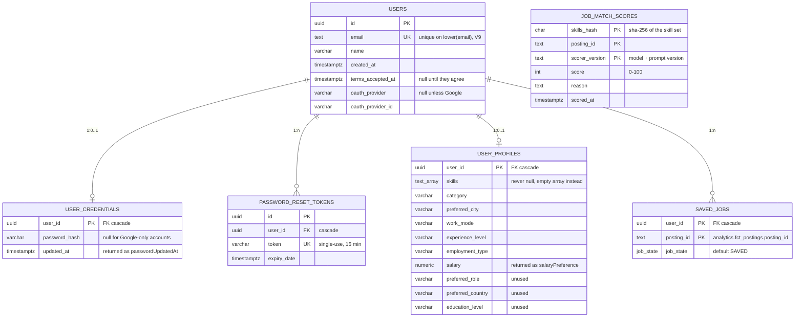

# API reference

Every route lives under `/api`. Requests and responses are JSON. The browser reaches the backend
through the Next.js proxy ([`frontend/src/proxy.ts`](../../frontend/src/proxy.ts)) and then the API
gateway ([`services/api-gateway`](../../services/api-gateway), Day 15), so the frontend and the API
share one origin. The backend has no published port; the gateway, on 8080, is the only way in
([`architecture.md`](architecture.md)).

What the gateway adds to every route below:

- **401 before the backend.** It applies the same access rules and verifies the `access_token`
  itself, so a private route without a valid token never reaches the backend.
- **`X-User-Id`** is set from the token's `sub` and any the client sent is dropped. The backend
  does not read it; it is for the services Phase 3 extracts.
- **429** on the four credential routes (below).
- **502** when the backend cannot be reached, **504** when it does not answer in 30 seconds.
- **403** for every cross-origin preflight, and no `Access-Control-*` header on any response.

The generated reference is assembled at runtime from the controllers:

| | URL |
| --- | --- |
| Scalar UI | https://c55c.hyf.dev/api/docs — locally http://localhost:8080/api/docs |
| OpenAPI spec | `/api/docs/openapi.yaml` |

That reference is the source of truth for shapes. **This document is the one for behaviour** — what
each endpoint does with the row it finds, why it answers the status it answers, and what is
deliberately not here.

---

## Table of contents

- [1. Data the API reads and writes](#1-data-the-api-reads-and-writes)
- [2. Endpoint summary](#2-endpoint-summary)
- [3. Authentication](#3-authentication)
- [4. Account](#4-account)
- [5. Profile](#5-profile)
- [6. Jobs](#6-jobs)
- [7. Matching](#7-matching)
- [8. Saved jobs](#8-saved-jobs)
- [9. Tokens and access rules](#9-tokens-and-access-rules)
- [10. Error responses](#10-error-responses)
- [11. Email](#11-email)
- [12. Not in the API](#12-not-in-the-api)

---

# 1. Data the API reads and writes

Two schemas in one database. The backend **writes** `app` and only reads `analytics`, which the data
pipeline publishes into once a day.



`job_match_scores` deliberately has **no** foreign key to `users`: it is keyed on the skill set, not
on the person, so nothing user-identifying is stored and two identical profiles share a row.

Three published tables are read, always by their `analytics.` name (the schema is written into the
SQL, not configurable):

| Table | Used for |
| --- | --- |
| `analytics.fct_postings` | Every job field the API returns |
| `analytics.fct_postings_cities` | The resolved city list — the location filter, the location dropdown, and the city shown on a posting |
| `analytics.fct_postings_skills` | The skills shown on a posting in search and detail |

There is no foreign key across the schema boundary, and there cannot be one: the pipeline replaces
those tables. A `posting_id` in `saved_jobs` can therefore outlive the posting it points at, which
is why the saved-jobs query is a `LEFT JOIN`.

---

# 2. Endpoint summary

`Auth` is what the security filter chain requires, not what the endpoint is useful without.

| Method | Path | Auth | Description |
| --- | --- | --- | --- |
| POST | /api/auth/register | none | Create an account, agreeing to the terms |
| POST | /api/auth/login | none | Sign in |
| POST | /api/auth/refresh | none | Trade the refresh cookie for new access and refresh cookies |
| POST | /api/auth/logout | none | Sign out |
| POST | /api/auth/forgot-password | none | Email a password reset link |
| POST | /api/auth/reset-password | none | Set a new password using a token |
| PATCH | /api/auth/password | signed in | Change the logged-in user's password |
| GET | /api/oauth2/authorization/google | none | Start Google sign-in (browser navigation) |
| GET | /api/users/me | signed in | Get the logged-in user |
| PUT | /api/users/me | signed in | Update the logged-in user's name |
| DELETE | /api/users/me | signed in | Delete the logged-in user's account |
| POST | /api/users/me/accept-terms | signed in | Agree to the terms after signing up with Google |
| GET | /api/profile | signed in | Get the logged-in user's job preferences |
| PUT | /api/profile | signed in | Save the logged-in user's job preferences |
| GET | /api/jobs | none | Search and filter job postings |
| GET | /api/jobs/filters | none | List the values available to filter on |
| GET | /api/jobs/{postingId} | none | Get one job posting in full |
| GET | /api/jobs/top-matches | signed in | Rank jobs against the user's profile |
| GET | /api/saved-jobs | signed in | List the user's saved jobs |
| POST | /api/saved-jobs | signed in | Save a job |
| PATCH | /api/saved-jobs/{postingId} | signed in | Move a saved job to another state |
| DELETE | /api/saved-jobs/{postingId} | signed in | Unsave a job |
| GET | /api/saved-jobs/stats | signed in | Count saved jobs per state |

Everything the user can act on is **self-service**: the account is resolved from the access token and
never from a path or body parameter, so no request can name someone else's row. That is why there is
no `/api/users/{id}` — see [section 12](#12-not-in-the-api).

---

# 3. Authentication

> How the tokens, the Google link flow and the password lifecycle actually work is in
> [`auth.md`](auth.md). What follows is the contract.

### POST /api/auth/register
Create an account, agreeing to the terms

| Endpoint | /api/auth/register |
| --- | --- |
| Method | POST |
| Auth | none |
| Request body | `{ "name": "string", "email": "string", "password": "string", "acceptedTerms": true }` |
| Response body | `{ "id": "uuid", "email": "string", "name": "string", "message": "User registered successfully" }` |
| Validations | All four fields required. Email must be well-formed, password at least 6 characters. `acceptedTerms` is boxed and carries both `@NotNull` and `@AssertTrue`, so a missing field and `false` are both 400 — the agreement cannot be skipped by calling the API directly. The email is lowercased before the duplicate check and before it is stored, so `User@x.com` and `user@x.com` are one account. |
| Behaviour | Account, password hash and `terms_accepted_at` are written in one transaction: no personal data is stored without the agreement. A concurrent registration that loses the race on the unique index is caught and answered 409, not 500. |
| Returns | 201 · 400 validation · 409 email already registered |

### POST /api/auth/login
Sign in

| Endpoint | /api/auth/login |
| --- | --- |
| Method | POST |
| Auth | none |
| Request body | `{ "email": "string", "password": "string" }` |
| Response body | `{ "email": "string", "name": "string", "termsAcceptedAt": "date-time or null" }` |
| Validations | Both fields required, email well-formed. A wrong email and a wrong password give the same 401, so the response cannot be used to discover which addresses are registered. Google-only accounts have no password hash and always fail here. |
| Behaviour | On success an access token and a refresh token are issued as cookies; nothing is stored in a session. A Google identity parked by a refused sign-in is claimed here and linked — see the Google section below. |
| Returns | 200 + `access_token` and `refresh_token` cookies · 400 validation · 401 invalid credentials |

A null `termsAcceptedAt` means the user has never agreed; the frontend sends them to `/accept-terms`.

### POST /api/auth/logout
Sign out

| Endpoint | /api/auth/logout |
| --- | --- |
| Method | POST |
| Auth | none |
| Request body | none |
| Response body | `{ "message": "Logged out successfully" }` |
| Behaviour | Handled by the security filter chain's logout handler, not by a controller, so it does **not** appear in the generated OpenAPI document. Revokes the refresh token the browser sent and deletes both cookies. The access token stays valid until it expires, at most 15 minutes. |
| Returns | 200 |

### POST /api/auth/refresh
Trade the refresh cookie for new access and refresh cookies

| Endpoint | /api/auth/refresh |
| --- | --- |
| Method | POST |
| Auth | none — it is the expired access token this replaces |
| Request body | none; the `refresh_token` cookie |
| Response body | none |
| Behaviour | Spends the refresh token (revoked in the same statement that finds it, so two requests cannot both use one) and sets both cookies anew. The frontend calls it once when an API call answers 401, then retries that call once. |
| Returns | 200 + both cookies · 401 no live refresh token, with both cookies deleted |

### POST /api/auth/forgot-password
Email a password reset link

| Endpoint | /api/auth/forgot-password |
| --- | --- |
| Method | POST |
| Auth | none |
| Request body | `{ "email": "string" }` |
| Response body | none |
| Validations | Email required and well-formed. **Always 200**, whether or not the address exists — answering differently would let anyone test which emails are registered. A Google-only account is skipped just as silently, because a reset link would dead-end at `reset-password`. |
| Behaviour | Any earlier token for the user is deleted first, so only the newest link works. The new token is two UUIDs, valid 15 minutes. The email is sent from an `afterCommit` hook, so a link never arrives pointing at a token that was rolled back, and it is sent `@Async` so SMTP latency does not hold the response. |
| Returns | 200 |

### POST /api/auth/reset-password
Set a new password using a token

| Endpoint | /api/auth/reset-password |
| --- | --- |
| Method | POST |
| Auth | none |
| Request body | `{ "token": "string", "newPassword": "string" }` |
| Response body | none |
| Validations | Both required, new password at least 6 characters. The token must exist and not be expired. The account must already have a password credential, so a Google-only account is rejected. |
| Behaviour | On success every reset token for that user is deleted, which is what makes the link single-use. |
| Returns | 200 · 400 invalid or expired token, or Google-only account |

### PATCH /api/auth/password
Change the password of the logged-in user

| Endpoint | /api/auth/password |
| --- | --- |
| Method | PATCH |
| Auth | signed in — the one route under `/api/auth/**` that is not public |
| Request body | `{ "currentPassword": "string", "newPassword": "string" }` |
| Response body | none |
| Validations | Both required, new password at least 6 characters, current password must match the stored hash. Google-only accounts are rejected: there is no password to verify. |
| Behaviour | Every refresh token the user holds is revoked and the caller gets a new pair of cookies, so another device is signed out once its access token expires, within 15 minutes. |
| Returns | 200 · 400 wrong current password or Google-only account · 401 not signed in |

### GET /api/oauth2/authorization/google
Start Google sign-in

| Endpoint | /api/oauth2/authorization/google |
| --- | --- |
| Method | GET — a browser navigation, not `fetch` |
| Auth | none |
| Response | a redirect, never JSON |
| Registered when | `GOOGLE_CLIENT_ID` is set. Without it the route does not exist and the app logs "Google sign-in disabled" at startup. |
| Behaviour | Both URIs sit under `/api` so the Next.js proxy forwards them and the cookies stay on one origin; Google returns to `/api/login/oauth2/code/google`. A Google account whose email is not verified is rejected in the `OidcUserService`, before anyone is signed in — an unverified address could otherwise claim an account by email match. |
| Returns | 302 to the frontend, per the table below |

| Outcome | Redirect |
| --- | --- |
| Signed in | `/` |
| First sign-in, terms not agreed yet | `/accept-terms` |
| Email already belongs to a password account | `/login?error=google_link_required` |
| Sign-in failed | `/login?error=oauth` |

`google_link_required` is deliberate. Registration never proved the user owns that address, so
linking on an email match alone would hand the account to whoever typed the address first. The
Google identity waits in `identity.pending_google_links`, for ten minutes, and is attached by the
next successful password login for that account, which is the proof that was missing; the browser
carries the claim code there in the `pending_google_link` cookie.

---

# 4. Account

### GET /api/users/me

| Endpoint | /api/users/me |
| --- | --- |
| Method | GET |
| Auth | signed in |
| Response body | `{ "id", "email", "name", "termsAcceptedAt", "createdAt", "oauthProvider", "oauthProviderId", "passwordUpdatedAt" }` |
| Validations | The account is resolved from the access token, so a caller can only ever read their own. |
| Notes | Everything past `name` exists for the data export rather than for the UI: `createdAt`, which Google account is linked (`oauthProviderId`, where `oauthProvider` only says that one is), and `passwordUpdatedAt` — null for Google-only accounts, and for a fresh account the moment of registration rather than a later change. The password hash is never returned. |
| Returns | 200 · 401 not signed in · 404 the token belongs to an account that no longer exists |

### PUT /api/users/me

| Endpoint | /api/users/me |
| --- | --- |
| Method | PUT |
| Auth | signed in |
| Request body | `{ "name": "string", "email": "string" }` |
| Response body | same as `GET /api/users/me` |
| Validations | Email is required, well-formed and 3–100 characters — and is then **ignored**. The address is the login identity: the principal, the reset lookup and the unique index all key on it, so changing it needs a verification flow that does not exist yet. |
| Behaviour | Only `name` is applied, and a null name leaves the existing one (unlike `PUT /api/profile`, which clears what is left out). `termsAcceptedAt`, `createdAt` and the OAuth columns are carried through untouched, so an edit can neither erase nor forge an agreement. |
| Returns | 200 · 400 invalid body · 401 not signed in · 404 account gone |

### DELETE /api/users/me

| Endpoint | /api/users/me |
| --- | --- |
| Method | DELETE |
| Auth | signed in |
| Response body | none |
| Behaviour | Every foreign key onto `users` cascades, so credentials, profile, saved jobs, outstanding reset tokens and refresh tokens go with the account. Both cookies are deleted in the same request — otherwise the browser would keep sending a token for a row that is gone and `/me` would answer 404 instead of 401. Cached match scores are keyed on the skill set, not the user, so there is nothing personal left behind. This is the GDPR Art. 17 erasure path. |
| Returns | 204 · 401 not signed in · 404 account gone |

### POST /api/users/me/accept-terms

| Endpoint | /api/users/me/accept-terms |
| --- | --- |
| Method | POST |
| Auth | signed in |
| Request body | none — being logged in and calling it is the agreement |
| Response body | same as `GET /api/users/me` |
| Behaviour | Registration already stamps `terms_accepted_at`, so this exists for Google sign-ups, which never see the checkbox. The timestamp is only set while it is still null, so calling it twice keeps the first one: an agreement cannot be moved forward. |
| Returns | 200 · 401 not signed in · 404 account gone |

---

# 5. Profile

The profile is what matching runs on. `skills` is the field that matters; the rest is preference.

### GET /api/profile

| Endpoint | /api/profile |
| --- | --- |
| Method | GET |
| Auth | signed in |
| Response body | `{ "userId", "skills": ["string"], "category", "preferredCity", "workMode", "experienceLevel", "employmentType", "salaryPreference" }` |
| Behaviour | An account with no row in `user_profiles` gets every preference null and `skills: []` — **not a 404**. A new user has to be able to open the profile screen, and the data export must not fail on someone who never filled the form in. `skills` is never null, so the caller renders it without a check. Skills come back in the spelling they were saved in. |
| Returns | 200 · 401 not signed in · 404 account gone |

### PUT /api/profile

| Endpoint | /api/profile |
| --- | --- |
| Method | PUT |
| Auth | signed in |
| Request body | `{ "skills": ["string"], "category", "preferredCity", "workMode", "experienceLevel", "employmentType", "salaryPreference" }` |
| Response body | same as `GET /api/profile`, as stored |
| Validations | 5–20 skills, each at most 100 characters. Text preferences at most 255 characters, matching their `varchar(255)` columns, so an over-long value is a 400 naming the field rather than a 500 from Postgres. `salaryPreference` must be non-negative with at most 8 digits and 2 decimals, matching `numeric(10,2)`. |
| Behaviour | **A PUT replaces the whole profile**: an optional field left out is cleared, which is the only way a user can empty something they filled in before. Skills are the exception — they are required, so leaving them out is a 400. A blank or whitespace-only value is stored as null, so "cleared" and "never filled in" stay one state. Blank skills are dropped, and skills that canonicalise the same way collapse to one (`React`, `react`, ` REACT ` are one skill), but **the spelling that was sent is what is stored and shown back**. The floor is then re-checked on the normalised list, so five entries that collapse to two are a 400 rather than a 200 the matcher would refuse to rank. The first save creates the row; there is no separate POST. |
| Canonical form | Lowercase, with hyphens and runs of whitespace collapsed to a single space — the mart holds `machine-learning` and `machine learning` as different skills. Note the matcher canonicalises differently: see [section 7](#7-matching). |
| Returns | 200 · 400 invalid body, or fewer than 5 skills after normalising · 401 not signed in · 404 account gone |

The three columns `V2` created that no form field feeds — `preferred_role`, `preferred_country`,
`education_level` — are left in place, neither read nor written.

---

# 6. Jobs

All three are public: browsing does not need an account. Every row comes from the mart, so a
database the pipeline has never published into answers `[]` rather than failing.

> Why the location filter works the way it does, what the freshness fields mean, and how the pages
> are rendered: [`jobs-search.md`](jobs-search.md).

### GET /api/jobs
Search and filter job postings

| Endpoint | `/api/jobs?q=&category=&workMode=&location=` |
| --- | --- |
| Method | GET |
| Auth | none |
| Query | All four optional; a blank value is treated as absent. `q` matches title, company, city or skill with `ILIKE %q%`. `category` and `workMode` are exact matches on the mart columns. `location` is an **exact city match** against `fct_postings_cities`, not a substring: the value comes from `/api/jobs/filters`, and matching `%Ede%` instead also returned Enschede, Medemblik, Nederweert and Sweden. |
| Response body | An array of `{ postingId, title, companyName, location, workMode, isRemote, skills, employmentType, postedDate, source, category, freshnessClass, ageDays, savedCount }` |
| Ordering and cap | `posted_date DESC NULLS LAST, posting_id`, capped at **200 rows**. The tie-breaker is what makes the cut-off stable between calls. There is no paging — see [section 12](#12-not-in-the-api). |
| Notes | `location` is the posting's cities, title-cased and joined with commas, not the raw location text. A hard-coded exclusion list keeps countries, provinces and "remote" out of every city-derived value, because the city column carries them too; provinces that double as city names (Utrecht, Groningen) and city-states (Singapore) stay in. The proper fix is upstream in the mart. `savedCount` counts distinct users who saved the posting — across all users, so it is a popularity signal, not "did I save this". `freshnessClass` and `ageDays` are the pipeline's verdict on how stale a listing is. Closed postings are **not** filtered out. |
| Returns | 200 |

### GET /api/jobs/filters
List the values available to filter on

| Endpoint | /api/jobs/filters |
| --- | --- |
| Method | GET |
| Auth | none |
| Response body | `{ "locations": [], "categories": [], "workModes": [], "experienceLevels": [], "employmentTypes": [] }` |
| Behaviour | `locations` are distinct cities from `fct_postings_cities`, title-cased for display and compared case-insensitively when they come back as `?location=`; the exclusion list above applies. The other four are distinct non-null values from `fct_postings`. Empty lists on an empty mart, never an error. |
| Used by | The job filters, and the profile form's category / city / work mode / experience / employment dropdowns — both screens offer exactly the values the data can match. |
| Returns | 200 |

### GET /api/jobs/{postingId}
Get one job posting in full

| Endpoint | /api/jobs/{postingId} |
| --- | --- |
| Method | GET |
| Auth | none |
| Response body | the search fields plus `description`, `experienceLevel`, `educationLevel`, `salaryMin`, `salaryMax`, `salaryCurrency`, `salaryPeriod`, `sourceUrl`, `status` |
| Behaviour | `{postingId}` is the mart's `posting_id`. Closed postings are served too, so a saved job does not 404 once it closes — `status` says which it is. `description` arrives with HTML stripped and entities decoded by the pipeline. `sourceUrl` is where "Apply externally" goes. |
| Returns | 200 · 404 no such posting |

---

# 7. Matching

> The design behind this endpoint — the skill vocabulary, the three normalisations, the cache, and
> what the profile does and does not influence — is in
> [`matching-profile.md`](matching-profile.md). What follows is the contract.

### GET /api/jobs/top-matches
Rank jobs against the logged-in user's profile

| Endpoint | /api/jobs/top-matches |
| --- | --- |
| Method | GET |
| Auth | signed in |
| Query | none — no `limit`, the answer is at most 25 rows |
| Response body | An array of `{ postingId, title, company, location, category, postedDate, matchedSkills, matchedCount, ofSkills, jobSkillCount, matchScore, matchPercent, label, score, reason, aiScored }`, best first |
| Returns | 200 · 401 not signed in · 422 no profile, or fewer than 5 skills on it |

**Two steps, and the split is the design.**

1. **SQL narrows.** `JobMatchRepository` takes open postings (`status = 'open' AND closed_at IS NULL`)
   that carry a valid JSON `skills` value, keeps those in the user's preferred city — remote roles
   count wherever the candidate lives, and a blank city means no location filter at all — and ranks
   them by how many of the user's skills the posting lists verbatim. Reposts are collapsed with a
   `row_number()` over `lower(title), lower(company_name)`, so one job posted three times cannot eat
   three shortlist places. The top **40** go forward. There is deliberately no `matched_count > 0`
   filter: a job asking for `postgresql` would never reach a profile saying `postgres`, and that is
   exactly what step 2 is there to rescue.
2. **The model rescores.** `MatchScorer` sends the shortlist — titles and skill lists only, never a
   location, never anything about the person — to an OpenAI-compatible chat-completions API and asks
   for `0–100` and a one-line reason per job. The list is then sorted by `score`, ties broken by
   `matchedCount`, and cut to **25**.

**The model is optional.** With no `LLM_API_KEY` the app logs a warning at startup and every row
comes back with `aiScored: false`, `reason: null` and `score` falling back to `matchPercent` — the
skill-overlap order, still ordered and still useful. Any failure degrades the same way: a timeout, a
provider rejecting `reasoning_effort`, a reply with no JSON array in it. `MatchScorer.score` never
throws.

**Reading the numbers.** `matchScore`, `matchPercent` and `label` are plain skill overlap over the
**job's** skill count — the share of what the posting asks for that the user already has — so they
pair with `matchedCount` and `jobSkillCount`, not with `ofSkills`. The denominator has a floor of 5,
so a posting listing one or two skills cannot read 100% off a single overlap. They do **not** drive
the order: `score` does, and it can see synonyms and seniority
that exact overlap cannot, so a 100% row can sit below an 80% one. `label` is `"strong match"` at 60%
or above and null otherwise — a badge, never a filter. `matchedSkills` is exact string overlap only,
so a job matched on `postgresql` will not list the user's `postgres` there even though the score
reflects it.

**Caching.** Verdicts are stored in `job_match_scores` under
`(sha-256 of the sorted, lowercased skill set, posting_id, model + prompt version)`. A returning
skill set only pays for the postings the daily publish added. Changing the model or the prompt
version invalidates every old verdict for free. The retention window (`LLM_SCORE_RETENTION_DAYS`,
minimum and default 1 day) is applied **on the read**, so nothing stale is ever served even if the
hourly purge is late, misconfigured, or has never run.

**One canonicalisation difference worth knowing.** `ProfileService` collapses hyphens and whitespace;
the matcher only lowercases and trims, because the mart is consistently hyphenated and collapsing
would break more matches than it repairs. So `machine-learning` and `machine learning` are one skill
on the profile screen and two to the matcher.

The 422s are two different problems with one status: no profile row at all
(*"Fill in your profile to see matching jobs."*) and a profile below the five-skill floor, which
older profiles can be even though the form and `UpdateProfileRequest` both enforce it now. Both
carry a message the frontend shows as-is.

---

# 8. Saved jobs

Saving stores an id and a state, nothing else, which is why it works against an empty mart. The
design and its consequences — the orphaned-row case, the state model, how the frontend discovers
saved state — are in [`saving-tracking.md`](saving-tracking.md).

### POST /api/saved-jobs

| Endpoint | /api/saved-jobs |
| --- | --- |
| Method | POST |
| Auth | signed in |
| Request body | `{ "postingId": "string" }` |
| Response body | none |
| Behaviour | Inserts with state `SAVED`. The posting id is not checked against the mart: an id that is not published yet, or not any more, is still the user's to keep. |
| Returns | 201 · 400 blank `postingId` · 401 not signed in · 409 already saved |

### GET /api/saved-jobs

| Endpoint | /api/saved-jobs |
| --- | --- |
| Method | GET |
| Auth | signed in |
| Response body | An array of `{ postingId, jobState, title, companyName, location, workMode, isRemote, skills, employmentType, postedDate, source, category, freshnessClass, ageDays }` |
| Behaviour | A `LEFT JOIN` onto the mart, on purpose. There is no foreign key across the schema boundary, so a posting the next publish drops leaves a row whose job fields are all null while `postingId` and `jobState` stand. Render or skip that case deliberately — an inner join would silently delete rows from the user's own list. `location` here is the mart's raw location text, not the resolved city list that `/api/jobs` builds. |
| Returns | 200 · 401 not signed in |

### PATCH /api/saved-jobs/{postingId}

| Endpoint | /api/saved-jobs/{postingId} |
| --- | --- |
| Method | PATCH |
| Auth | signed in |
| Request body | `{ "newState": "SAVED \| APPLIED \| REJECTED \| ACCEPTED \| DECLINED" }` |
| Response body | none |
| Behaviour | Any state can move to any other: the `job_state` enum constrains the values, not the transitions, and nothing in the backend adds a flow on top. An unknown value is a 400 from JSON binding. |
| Returns | 200 · 400 missing or unknown state · 401 not signed in · 404 the user has not saved this posting |

### DELETE /api/saved-jobs/{postingId}

| Endpoint | /api/saved-jobs/{postingId} |
| --- | --- |
| Method | DELETE |
| Auth | signed in |
| Returns | 204 · 401 not signed in · 404 the user has not saved this posting |

### GET /api/saved-jobs/stats

| Endpoint | /api/saved-jobs/stats |
| --- | --- |
| Method | GET |
| Auth | signed in |
| Response body | `{ "APPLIED": 3, "SAVED": 7 }` |
| Behaviour | A `GROUP BY` over the user's rows, so **a state with no rows is absent from the map rather than zero**. Callers must default a missing key to 0. Reads only `saved_jobs`, so it works against an empty mart. |
| Returns | 200 · 401 not signed in |

---

# 9. Tokens and access rules

Since Day 13, two cookies and no session. `POST /api/auth/login`, a password change or a Google
sign-in sets `access_token` (an RS256 JWT, 15 minutes, `Path=/`) and `refresh_token` (opaque, 30
days, `Path=/api/auth`); every later request is authenticated by the access token, verified in the
backend. `POST /api/auth/refresh` trades the second for a new pair.

Both cookies are `HttpOnly` and `SameSite=Lax`; neither is `Secure` yet (see
[`auth.md`](auth.md#10-known-limitations)). JavaScript cannot read them, so browser calls have to
opt in to sending them:

```js
fetch("/api/users/me", { credentials: "include" })
```

The filter chain, in order:

| Rule | Effect |
| --- | --- |
| `PATCH /api/auth/password` | authenticated — listed first, or the next rule would make it public |
| `/api/auth/**` | public, refresh included |
| `/api/docs/**`, `/error` | public |
| `/api/oauth2/**`, `/api/login/oauth2/**` | public |
| `GET /api/jobs/top-matches` | authenticated — listed before the public job routes |
| `GET /api/jobs`, `/api/jobs/filters`, `/api/jobs/*` | public |
| anything else | authenticated |

CSRF, HTTP Basic and form login are disabled: this is a stateless JSON API behind a same-origin
proxy. The unauthenticated entry point is a plain `401`, not a redirect — without that override
`oauth2Login` would redirect an API call to Google, a `fetch` would follow it cross-origin, and the
caller would see a network error instead of "not logged in".

An expired or tampered access token counts as no token: a public route answers as it does for anyone,
a protected one answers 401. A password change or reset revokes every refresh token the user holds.

---

# 10. Error responses

**Every error the application raises is an RFC 9457 `ProblemDetail`.** Validation failures, bad
credentials, duplicate emails and every `ResponseStatusException` all go through
`GlobalExceptionHandler`, so the body reads the same in dev and in prod:

```json
{ "type": "about:blank", "status": 400, "title": "Validation failed",
  "detail": "One or more fields are invalid",
  "instance": "/api/auth/register",
  "errors": { "password": "Password must be at least 6 characters" } }
```

`errors` maps field name to message and appears only on validation failures; several messages on one
field are joined with `; `.

Two things are not `ProblemDetail`:

- **A 401 from the security layer has no body at all**, just the status. It never reaches the
  handler.
- **Logout** answers its own `{ "message": "Logged out successfully" }` from the filter chain.

Stack traces and error messages are pinned off (`server.error.include-stacktrace: never`,
`include-message: never`), so devtools cannot leak a trace in development that production would not
show.

| Status | When |
| --- | --- |
| 400 | Validation failed; fewer than 5 skills after normalising; invalid or expired reset token; wrong current password; a Google-only account asked to change or reset a password |
| 401 | Not signed in (no access token, or an expired or tampered one), a spent refresh token, or wrong email/password on login |
| 404 | No such job posting; a saved job the user does not have; an access token for a deleted account |
| 409 | Email already registered; job already saved |
| 422 | `top-matches` with no profile, or fewer than 5 skills on it |

---

# 11. Email

| Trigger | Recipient | Contents |
| --- | --- | --- |
| `POST /api/auth/forgot-password` for an address that has a password | that address | A reset link, `{APP_BASE_URL}/reset-password?token=...`, valid 15 minutes and single-use |

This is the only email the backend sends. It goes out over Brevo SMTP after the token is committed,
asynchronously. Without `MAIL_USERNAME` and `MAIL_PASSWORD` the app logs a warning at startup and
sending fails silently — reset links never arrive in a fresh checkout, while `forgot-password` still
answers 200, because the response cannot depend on the address existing either way.

---

# 12. Not in the API

Things a reader will look for and not find. Each is a decision, not an oversight — except the last
two, which are not built yet.

**No `GET /api/users`, `POST /api/users` or `/api/users/{id}`.** Listing every account and letting
any caller edit any row were defects, not features; they were removed rather than hidden behind a
role that would have had to be built first. Everything user-facing is self-service under `/me`.
(The frontend still has a `/users` page calling `GET /api/users`; it answers 404, and the page should
go.)

**No `/api/terms` or `/api/privacy`.** The documents are static pages in the frontend
([`/terms`](../../frontend/src/app/terms/page.tsx),
[`/privacy`](../../frontend/src/app/privacy/page.tsx)). Serving prose from the API would buy nothing:
it changes with a deploy, not with a request. What the backend contributes is the *record* of the
agreement — `terms_accepted_at`, written at registration or by `accept-terms`.

**No data-export endpoint.** The GDPR Art. 15 export is assembled in the browser from three calls,
each sending the access-token cookie:

| Call | Section of the export |
| --- | --- |
| `GET /api/users/me` | account |
| `GET /api/profile` | job preferences |
| `GET /api/saved-jobs` | saved jobs |

Together they cover every table that holds anything personal. The cost of doing it client-side is
that **nothing detects it when the backend starts storing something new** — whoever adds a table has
to remember to extend the export. Moving it behind one endpoint is on the roadmap for that reason.
The full data inventory, consent gate and erasure path are in [`privacy-data.md`](privacy-data.md).

**No `isSaved` on job responses.** `/api/jobs` reports `savedCount` across all users, not whether the
caller saved a posting; the frontend gets that by holding `GET /api/saved-jobs` alongside the list.
Worth revisiting if the saved list ever grows past what one request should carry.

**No pagination.** `/api/jobs` returns at most 200 rows, newest first, and `top-matches` at most 25.
Neither takes a page parameter yet.

**Rate limiting covers credentials only.** The gateway allows ten requests a minute per client,
shared across `POST /api/auth/login`, `register`, `forgot-password` and `reset-password`, and
answers the eleventh with 429 (`RATE_LIMIT_AUTH_PER_MINUTE`). A client is the connecting address:
the frontend passes a client's own `X-Forwarded-For` through, so it is not believed, and locally
every browser shares the frontend's one bucket. Nothing yet throttles the model-backed
`top-matches`, which is the way to spend money.
