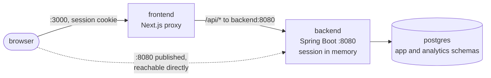
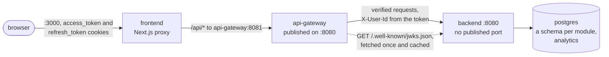

# Architecture

How a request reaches the backend, before Phase 2 and after it. Phase 2 (Days 12–16) replaced the
server session with signed tokens and put an API gateway in front of the backend; nothing was
extracted yet, so there is still one backend and one database behind it.

## Before: the backend is the way in

- The login was a server session: a servlet session cookie naming state held in the backend's memory,
  so a restart signed everyone out and a second instance would not have known the user.
- Google sign-in parked its half-finished link in the same session.
- The backend published 8080 on the host, so anything could reach it without the frontend.

## After: the gateway is the way in

- **Tokens, not a session.** Login sets an RS256 `access_token` (15 minutes) and a `refresh_token`
  cookie whose hash is stored in `identity.refresh_tokens`. Google's pending link is a short-lived
  row in `identity.pending_google_links`. Nothing about a user lives in a container's memory.
  See [`auth.md`](auth.md).
- **The gateway checks before it forwards.** It verifies the access token against the key set the
  backend publishes, applies the backend's own access rules, and answers a private route without a
  valid token itself (401). It replaces any `X-User-Id` a client sent with the token's subject.
- **The backend still checks.** It verifies the token on every request and never reads
  `X-User-Id`: it does not trust the network.
- **The gateway owns the edges:** the rate limit on the four credential routes (429), 502 when the
  backend cannot be reached and 504 when it does not answer in time, a trace that continues into
  the backend, and a 403 for every cross-origin preflight.
- **Only the gateway is published.** The backend is reachable at `backend:8080` inside the compose
  network and nowhere else; the frontend's `BACKEND_API_URL` names the gateway.

Settings for each box are in [`configuration.md`](configuration.md). What comes next — extracting
job-service behind the same gateway — is Phase 3 in [`plan.md`](../../plan.md).
