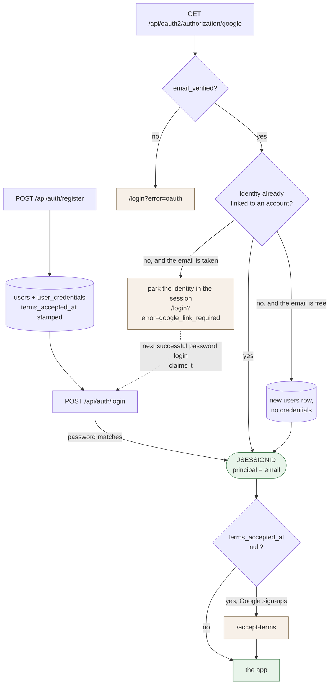
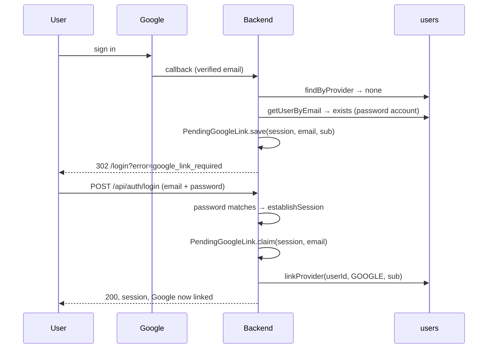

# Authentication

Two ways into an account — a password, or Google — and one session mechanism behind both. The
email address is the identity: it is the session principal, the reset lookup, and the unique index,
which is why it cannot be edited and why the Google flow works the way it does.

Everything here lives in [`auth/`](../src/main/java/nl/hackyourfuture/project/backend/auth) and
[`config/SecurityConfig`](../src/main/java/nl/hackyourfuture/project/backend/config/SecurityConfig.java).
The endpoint-by-endpoint contract — bodies, statuses, validation — is in [`api.md`](api.md); this
document is about how the pieces fit and what happens when they do not.

---

## Table of contents

- [1. The three ways a session starts](#1-the-three-ways-a-session-starts)
- [2. Registration](#2-registration)
- [3. Password login](#3-password-login)
- [4. Google sign-in](#4-google-sign-in)
- [5. The session](#5-the-session)
- [6. Passwords: change, forget, reset](#6-passwords-change-forget-reset)
- [7. Agreeing to the terms](#7-agreeing-to-the-terms)
- [8. Deleting the account](#8-deleting-the-account)
- [9. Configuration](#9-configuration)
- [10. Known limitations](#10-known-limitations)
- [11. Troubleshooting](#11-troubleshooting)

---

# 1. The three ways a session starts



Three things are worth reading off that picture:

- **A session is a session.** However it started, the principal is the lowercased email string and
  every later request is authenticated by the cookie. Nothing downstream knows or cares which door
  the user came through.
- **A Google identity is never linked on an email match alone.** That is the `google_link_required`
  branch, and [section 4](#4-google-sign-in) explains why.
- **The terms gate is after the session, not before it.** A Google user is logged in while they are
  on `/accept-terms`; what they cannot do yet is have a profile, because they have not agreed to
  anything being stored.

---

# 2. Registration

`POST /api/auth/register` with name, email, password and `acceptedTerms: true`.

The email is lowercased before anything else happens
([`AuthenticationService.register`](../src/main/java/nl/hackyourfuture/project/backend/auth/AuthenticationService.java)),
so `User@Example.com` and `user@example.com` are one account. `V9` normalised the existing rows and
put the unique index on `lower(email)`, so the database enforces the same thing the code assumes.

Three writes, one transaction:

| Write | Why it is in the same transaction |
| --- | --- |
| `users` | the account |
| `user_credentials` | the BCrypt hash, never the password |
| `users.terms_accepted_at` | **no personal data is stored without the agreement** — a half-written account that skipped this would be exactly the thing the checkbox exists to prevent |

The agreement is enforced in the backend, not by the frontend checkbox: `acceptedTerms` is a boxed
`Boolean` carrying both `@NotNull` and `@AssertTrue`, so a missing field and an explicit `false` are
both a 400. `@AssertTrue` alone ignores null, which is why both annotations are there.

There is a `getUserByEmail` check before the insert *and* a `DuplicateKeyException` catch around it.
The check is for the message; the catch is for the race, where two registrations for one address
arrive together and the unique index picks a winner. Both answer 409.

Registration does not start a session. The frontend sends the user to `/login?registered=true`.

---

# 3. Password login

`POST /api/auth/login` looks the account up with `findCredentialsByEmail`, which is an **inner join**
onto `user_credentials`. A Google-only account has no row there, so it does not come back at all and
falls into the same failure as a wrong address.

That is the point: a wrong email, a wrong password, and an address that only exists as a Google
account all answer the same `401 Invalid email or password`. The response cannot be used to discover
which addresses are registered, or how they sign in.

On success, `establishSession` does three things in order:

1. builds a `UsernamePasswordAuthenticationToken` whose principal is the **email string** — not a
   `UserDetails`, which is why every controller resolves the principal with a small helper that
   accepts either and rejects `"anonymousUser"`;
2. calls `changeSessionId()`, so a cookie captured before login is worthless after it;
3. stores the security context on the session under
   `HttpSessionSecurityContextRepository.SPRING_SECURITY_CONTEXT_KEY`.

Then `completePendingGoogleLink` runs — see the next section.

The response carries `termsAcceptedAt`. Null means the user has never agreed, and the frontend sends
them to the terms screen instead of the app.

---

# 4. Google sign-in

Enabled only when `GOOGLE_CLIENT_ID` is set.
[`GoogleOAuth2Config`](../src/main/java/nl/hackyourfuture/project/backend/config/GoogleOAuth2Config.java)
is `@ConditionalOnExpression` on it, and `SecurityConfig` only calls `oauth2Login(...)` when a
`ClientRegistrationRepository` bean exists. Without credentials the routes simply do not exist and
the app logs `Google sign-in disabled` at startup — rather than failing to boot, which is what
Spring Boot's own `spring.security.oauth2` properties would do.

Both URIs sit under `/api` so the Next.js proxy forwards them and the cookie stays on one origin:

| | URI |
| --- | --- |
| Start | `/api/oauth2/authorization/google` — a browser navigation, never `fetch` |
| Callback | `/api/login/oauth2/code/google` |

**The verified-email check comes first.** The custom `OidcUserService` rejects a Google account
whose `email_verified` is false, or that has no email at all, *before* the success handler runs and
before any session is authenticated. An unverified address could otherwise be used to claim an
account by email match.

## What the success handler does

[`OAuth2LoginSuccessHandler`](../src/main/java/nl/hackyourfuture/project/backend/auth/OAuth2LoginSuccessHandler.java)
resolves the identity in this order:

1. **Already linked** (`oauth_provider = GOOGLE` and `oauth_provider_id = sub`) → that account.
2. **The email is free** → create a `users` row with the provider columns set and **no**
   `user_credentials` row. The account has no password and never will until someone resets one,
   which they cannot, because reset requires an existing credential row.
3. **The email already belongs to an account** → refuse, and park the identity.

## Why an email match is not enough

Registration never proved the user owns the address they typed. If a Google sign-in linked itself to
any account with a matching email, then registering `someone-elses@gmail.com` first would hand you
their Google identity — and with it, a permanent way in.

So the identity waits instead.
[`PendingGoogleLink`](../src/main/java/nl/hackyourfuture/project/backend/auth/PendingGoogleLink.java)
stores the email and the provider id in the session, no authentication is established, and the
browser goes to `/login?error=google_link_required`. The next successful **password** login for that
same address claims the parked identity and links it:



`claim` only hands the provider id over if the session's parked email matches the one that just
proved itself, and it removes the attributes as it does — so the link can happen once and only for
the account that earned it. `linkProvider` updates `WHERE oauth_provider_id IS NULL`, so a second
identity cannot displace one already attached; it returns false and the log says so.

A linked account keeps its password. Both doors work from then on.

## Where the browser lands

| Outcome | Redirect | Property |
| --- | --- | --- |
| Signed in, terms already agreed | `/` | `OAUTH2_SUCCESS_REDIRECT` |
| Signed in, terms not agreed yet | `/accept-terms` | `OAUTH2_TERMS_REDIRECT` |
| Email belongs to a password account | `/login?error=google_link_required` | `OAUTH2_LINK_REDIRECT` |
| Anything failed, including an unverified email | `/login?error=oauth` | `OAUTH2_FAILURE_REDIRECT` |

All four default to a path under `app.base-url`, so setting `APP_BASE_URL` per environment is
normally all that is needed. The login page reads the `error` query parameter and shows the matching
message.

---

# 5. The session

A cookie, not a token. There is no JWT anywhere in this backend.

| Property | Value | Set by |
| --- | --- | --- |
| Name | `JSESSIONID` | servlet container |
| `HttpOnly` | true | `server.servlet.session.cookie.http-only` |
| `SameSite` | `Lax` | `server.servlet.session.cookie.same-site` |
| `Secure` | `SESSION_COOKIE_SECURE`, default **false** | must be `true` wherever the site is HTTPS |

JavaScript cannot read the cookie, so browser calls have to opt in to sending it. The shared
`request()` helper in [`frontend/src/lib/api.ts`](../../frontend/src/lib/api.ts) sets
`credentials: "include"` for every call that goes through it; a call written by hand that forgets it
looks exactly like being logged out:

```js
fetch("/api/users/me", { credentials: "include" })
```

## What the filter chain allows

Order matters here: the first matching rule wins, which is why the two `authenticated()` lines sit
above the broader `permitAll()` lines they carve out of.

| Rule | Effect |
| --- | --- |
| `PATCH /api/auth/password` | authenticated |
| `/api/auth/**` | public |
| `/error`, `/api/docs/**` | public |
| `/api/oauth2/**`, `/api/login/oauth2/**` | public |
| `GET /api/jobs/top-matches` | authenticated |
| `GET /api/jobs`, `/api/jobs/filters`, `/api/jobs/*` | public |
| everything else | authenticated |

CSRF, HTTP Basic and form login are disabled: this is a JSON API behind a same-origin proxy.

**The 401 entry point is deliberate.** Without
`authenticationEntryPoint(new HttpStatusEntryPoint(UNAUTHORIZED))`, `oauth2Login` installs its own
entry point, which *redirects* an unauthenticated request to Google. A browser `fetch` follows that
cross-origin, gets blocked by CORS, and the caller sees a network error instead of "not logged in".
With it, an unauthenticated call is a plain `401` with an empty body — no `ProblemDetail`, because
it never reaches `GlobalExceptionHandler`.

## Logout

`POST /api/auth/logout` is handled by the chain's logout handler, not a controller: it invalidates
the session, deletes `JSESSIONID`, and writes `{"message": "Logged out successfully"}`. Because no
controller is involved it does **not** appear in the generated OpenAPI document.

`DELETE /api/users/me` repeats the same two handlers by hand
(`SecurityContextLogoutHandler` + `CookieClearingLogoutHandler`) — otherwise the session would
outlive the deleted row and `/me` would answer 404 instead of 401.

---

# 6. Passwords: change, forget, reset

Hashing is BCrypt, via the `PasswordEncoder` bean in `SecurityConfig`. The plaintext is never
stored, never logged, and never returned.

Every one of these three flows refuses a Google-only account, and for the same structural reason:
there is no `user_credentials` row, so there is no current password to verify and nothing to update.

### Change — `PATCH /api/auth/password`

Session required, and it is the one route under `/api/auth/**` that is not public. The current
password must match; then the hash is replaced, `updated_at` moves (this is what `/api/users/me`
reports as `passwordUpdatedAt`), and `establishSession` runs again so the session id changes. Another
session holding the old cookie is dropped.

### Forget — `POST /api/auth/forgot-password`

**Always 200.** An address that does not exist, and a Google-only account that cannot use a reset
link, both take the same silent path as a success. Anything else would let a caller test which
addresses are registered.

When the address does have a password:

1. every existing token for that user is deleted, so only the newest link works;
2. a token — two UUIDs joined by a hyphen — is stored with a 15-minute expiry;
3. the email is sent from an `afterCommit` hook, so a link can never arrive pointing at a token that
   was rolled back, and `@Async`, so SMTP latency does not hold the response.

The link is `{APP_BASE_URL}/reset-password?token=...`. Sending goes over Brevo SMTP and failures are
caught and logged — from the caller's side, a broken mail configuration is indistinguishable from an
address that does not exist, which is the same property the flow already relies on.

### Reset — `POST /api/auth/reset-password`

The token must exist and have `expiry_date > CURRENT_TIMESTAMP`. On success the hash is replaced and
**every** token for that user is deleted, which is what makes the link single-use.

An invalid, expired, or already-used token is one message: `Invalid or expired password reset token`.

---

# 7. Agreeing to the terms

`users.terms_accepted_at` is part of authentication, not a side note: it is stamped in the same
transaction as the account, and a null value routes the user to `/accept-terms` before they reach
the app.

| Path in | How the timestamp is set |
| --- | --- |
| Registration | in the same transaction as the account |
| Google sign-in | `POST /api/users/me/accept-terms`, after the redirect to `/accept-terms` |

The endpoint takes no body — being logged in and calling it *is* the agreement — and
`acceptTerms` updates `WHERE terms_accepted_at IS NULL` using `now()` from the database clock. So
calling it twice keeps the first timestamp, and neither a repeat call nor an account edit can move
an agreement forward. `PUT /api/users/me` carries the column through untouched for the same reason.

---

# 8. Deleting the account

`DELETE /api/users/me` removes the `users` row. Every table that points at it cascades:
credentials, profile, saved jobs, outstanding reset tokens.

`job_match_scores` has no foreign key to `users` on purpose — it is keyed on a hash of the skill set
rather than on a person — so there is nothing user-identifying left behind after the cascade.

The session is ended and the cookie cleared in the same request, as described above.

---

# 9. Configuration

All of it reads an environment variable with a local-development fallback; see
[`application.yaml`](../src/main/resources/application.yaml) and
[`.env.example`](../.env.example).

| Variable | Default | What it does |
| --- | --- | --- |
| `APP_BASE_URL` | `http://localhost:3000` | The public address of the environment. Every OAuth redirect and the password-reset link are built from it. **No trailing slash** — the redirect URIs append to it, and `//` will not match what Google has registered. Production is `https://c55c.hyf.dev`. |
| `SESSION_COOKIE_SECURE` | `false` | Must be `true` on any HTTPS deployment |
| `GOOGLE_CLIENT_ID` | empty | Set it and Google sign-in exists; leave it and the routes do not |
| `GOOGLE_CLIENT_SECRET` | empty | |
| `GOOGLE_REDIRECT_URI` | `${APP_BASE_URL}/api/login/oauth2/code/google` | Must match the Google Cloud Console entry character for character |
| `OAUTH2_SUCCESS_REDIRECT` | `${APP_BASE_URL}/` | |
| `OAUTH2_TERMS_REDIRECT` | `${APP_BASE_URL}/accept-terms` | |
| `OAUTH2_LINK_REDIRECT` | `${APP_BASE_URL}/login?error=google_link_required` | |
| `OAUTH2_FAILURE_REDIRECT` | `${APP_BASE_URL}/login?error=oauth` | |
| `MAIL_USERNAME`, `MAIL_PASSWORD` | empty | Brevo SMTP. Without them the app warns at startup and reset emails silently fail |
| `MAIL_FROM` | `jobmatch.team2026@gmail.com` | Sender address on the reset email |

## Setting Google up

1. Google Cloud Console → **APIs & Services → Credentials → OAuth client ID**, type *Web
   application*.
2. Authorised redirect URI: exactly the value of `GOOGLE_REDIRECT_URI` —
   `http://localhost:3000/api/login/oauth2/code/google` locally,
   `https://c55c.hyf.dev/api/login/oauth2/code/google` in production. Add both if one client serves
   both.
3. Put the id and secret in `backend/.env`; `docker-compose.yml` passes both through to the
   container.
4. Restart and check the startup log for `Google sign-in enabled at ...`, which prints the redirect
   URI the app will actually use.

Note that the redirect URI points at **port 3000**, the frontend. The proxy forwards `/api/*` to the
backend, and that is what keeps the cookie on one origin.

---

# 10. Known limitations

Honest list. None of these is a bug in the current deployment; all of them are things to know before
changing it.

- **Sessions live in the servlet container's memory.** There is no Spring Session, no Redis, no
  database-backed store. A backend restart logs everyone out, and running two backend instances
  needs sticky sessions or a shared store first.
- **CSRF protection is `SameSite=Lax` and nothing else.** CSRF tokens are disabled and the session
  is a cookie, so `Lax` — which withholds the cookie from cross-site POSTs — is what stands between
  the API and a cross-site form. That is adequate for the current shape; it stops being adequate the
  day something is served from another origin.
- **No rate limiting.** Nothing throttles login attempts or password-reset requests, so no endpoint
  answers 429. The login form is the way in, which makes it the first thing to cover.
- **No email verification on registration.** This is the root of the whole `google_link_required`
  dance: because an address is never proved at sign-up, a Google identity cannot trust it either.
  Verifying at registration would let the link happen on the first sign-in instead.
- **The email address cannot be changed.** It is the login identity, the reset lookup and the unique
  index, so changing it needs a verification flow that does not exist. `PUT /api/users/me` accepts
  an `email` field and ignores it.
- **Reset tokens are two UUIDs, not a cryptographically-random secret.** `UUID.randomUUID()` is
  backed by a secure random source, so this is fine in practice, but it is a coincidence of the
  implementation rather than a stated intent.

---

# 11. Troubleshooting

| Symptom | Cause |
| --- | --- |
| Startup log says `Google sign-in disabled: no OAuth2 client credentials configured` | `GOOGLE_CLIENT_ID` is empty. The `/api/oauth2/**` routes do not exist, and the button 404s |
| Google answers `redirect_uri_mismatch` | `GOOGLE_REDIRECT_URI` and the Console entry differ — often a trailing slash on `APP_BASE_URL`, or `localhost` vs `127.0.0.1` |
| Sign-in succeeds but the browser lands on `localhost:3000` in production | `APP_BASE_URL` is unset there, so every redirect still holds its local default |
| `/login?error=google_link_required` | Working as designed: that email already has a password account. Log in with the password once and the identity attaches itself |
| `/login?error=oauth` | The failure handler. Most often the Google account's email is not verified; check the log |
| Every browser call answers 401 even though login succeeded | The `fetch` is missing `credentials: "include"`, or the cookie was rejected — `SESSION_COOKIE_SECURE=true` on plain HTTP will do that |
| Everyone is logged out after a deploy | Sessions are in memory; a restart drops them. Expected until a shared session store exists |
| Login answers 401 for an account the user is sure exists | It may be a Google-only account: no credentials row, so the password path cannot find it |
| Reset email never arrives | `MAIL_USERNAME` / `MAIL_PASSWORD` unset — the startup log warns, and `forgot-password` still answers 200 by design |
| `Invalid or expired password reset token` on a fresh link | Older than 15 minutes, already used, or a newer link was requested — requesting one deletes the previous token |
| A new endpoint answers 401 for a logged-out caller when it should be public | Unlisted paths are `authenticated()` by default; add it to `SecurityConfig` |
| `/api/users/me` answers 404 rather than 401 | The session points at an account that no longer exists — normally only reachable if the row was deleted outside `DELETE /api/users/me` |
