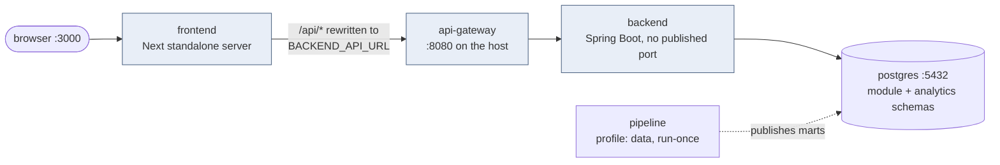

# Configuration

Every setting the three services read, where it comes from, and what breaks without it. One page, so
that "why does it work on my machine" has somewhere to be answered.

The rule everywhere: **each value reads an environment variable and falls back to a
local-development default**, so a fresh clone runs with nothing configured, and every environment
past that one is a list of overrides rather than an edited file.

---

## Table of contents

- [1. Four env files, and who reads them](#1-four-env-files-and-who-reads-them)
- [2. The local stack](#2-the-local-stack)
- [3. Backend](#3-backend)
- [4. Frontend](#4-frontend)
- [5. Data pipeline](#5-data-pipeline)
- [6. The database: schemas and roles](#6-the-database-schemas-and-roles)
- [7. What degrades without which key](#7-what-degrades-without-which-key)
- [8. Production checklist](#8-production-checklist)
- [9. Gotchas](#9-gotchas)

---

# 1. Four env files, and who reads them

| File | Read by | Committed? |
| --- | --- | --- |
| [`.env`](../../.env.example) | `docker-compose.yml`, for `${...}` substitution — the Postgres container's credentials, and Google's if you put them there | No. `.env.example` is |
| [`backend/.env`](../.env.example) | Loaded by hand for `./mvnw spring-boot:run`. **Not** read by compose: the backend service has no `env_file` | No |
| [`frontend/.env.local`](../../frontend/.env.example) | Next, in local development | No |
| [`data/.env`](../../data/.env.example) | The pipeline scripts and `astro dev start` | No |

**Spring Boot does not read `.env` by itself.** Running the backend outside Docker means loading it
yourself — `set -a; source .env; set +a`, an IDE plugin, or `--env-file` — or setting the variables
in the run configuration.

Under compose, the backend gets exactly what its `environment:` block names and nothing else. It
does not name `GOOGLE_CLIENT_ID`, `LLM_API_KEY` or the mail settings, so the compose stack runs
with Google sign-in off (its routes are 404), overlap-only matching and no reset emails — see
[section 7](#7-what-degrades-without-which-key). Run the backend by hand with `backend/.env` for
those.

---

# 2. The local stack



```bash
cp .env.example .env
scripts/dev-up.sh          # docker compose up -d db backend api-gateway frontend
```

| Service | Port | Notes |
| --- | --- | --- |
| `db` | 5432 | `postgres:18.4-alpine`, volume `db-data`, `pg_isready` healthcheck |
| `jwt-key` | — | Runs and exits. Writes the token signing key into the `jwt-keys` volume on the first start, then keeps it until `down -v` |
| `backend` | — | Built from `./backend`. Listens on 8080 inside the network only (Day 16). Waits for the database to be healthy and for `jwt-key` to finish |
| `api-gateway` | 8080 | Built from `./services/api-gateway`. Listens on 8081, published on 8080. `depends_on: backend` |
| `frontend` | 3000 | Built from `./frontend`. `depends_on: api-gateway` — start order only, **not** readiness |
| `pipeline` | — | Under the `data` profile, so `up` never starts it. It runs and exits: `docker compose run --rm pipeline` |

The browser only ever talks to port 3000. Next rewrites `/api/*` to `BACKEND_API_URL`
([`proxy.ts`](../../frontend/src/proxy.ts)), the gateway, which is what keeps the auth cookies on one
origin; the gateway refuses every cross-origin preflight. [`architecture.md`](architecture.md) draws
the path before and after the gateway.

The gateway's settings, all with defaults that suit compose:

| Variable | Default | |
| --- | --- | --- |
| `BACKEND_URL` | `http://localhost:8080` — `http://backend:8080` in compose | Where it forwards, and where it fetches `/.well-known/jwks.json` |
| `RATE_LIMIT_AUTH_PER_MINUTE` | `10` | Login, register and the two password-reset steps, per client |
| `GATEWAY_TRUSTED_PROXIES` | empty | A regex of proxy addresses whose `X-Forwarded-For` is believed. Leave it empty behind the frontend, which passes a client's own header through; set it only for a proxy that overwrites it |
| `GATEWAY_CONNECT_TIMEOUT` / `GATEWAY_READ_TIMEOUT` | `5s` / `30s` | Past them the gateway answers 502 / 504 |
| `TRACING_EXPORT_ENABLED`, `OTEL_TRACES_ENDPOINT` | `false`, local Tempo | As the backend's |

**Nothing checks that the backend is actually up.** There is no actuator, no `/health`, and no
healthcheck on the backend service — the frontend container starts as soon as the backend container
starts, which is not the same as ready. In practice Next only calls the backend when a page is
requested, so this is invisible until something automates against it.

---

# 3. Backend

All of it in [`application.yaml`](../src/main/resources/application.yaml).

## Database

| Variable | Default | |
| --- | --- | --- |
| `DB_HOST` | `localhost` | `db` under compose |
| `DB_PORT` | `5432` | |
| `DB_NAME` | `project_db` | |
| `DB_SCHEMA` | `app` | Also the schema Flyway migrates |
| `DB_USER` | `admin` | `app_user` in a production-like setup |
| `DB_PASSWORD` | `password` | |

## Application

| Variable | Default | |
| --- | --- | --- |
| `APP_BASE_URL` | `http://localhost:3000` | The public address. Every OAuth redirect and the password-reset link are built from it. **No trailing slash** |
| `SESSION_COOKIE_SECURE` | `false` | Despite the name, no session cookie since Day 14: `Secure` on the two token cookies and the Google flow's two, `google_auth_request` and `pending_google_link`. Must be `true` on HTTPS |
| `JWT_PRIVATE_KEY_FILE` | none | The RSA key tokens are signed with: a PEM, PKCS#8 file of at least 2048 bits. **Required**, in every profile; the backend never makes one. Compose sets it to the key its `jwt-key` service writes; outside compose, `scripts/jwt-key.sh backend/.jwt/private.pem` |
| `SPRING_PROFILES_ACTIVE` | none | `dev` or `prod`. The Docker image sets `SPRING_PROFILES_DEFAULT=prod` |

## Google sign-in

| Variable | Default | |
| --- | --- | --- |
| `GOOGLE_CLIENT_ID` / `GOOGLE_CLIENT_SECRET` | empty | Empty means the OAuth routes do not exist at all |
| `GOOGLE_REDIRECT_URI` | `${APP_BASE_URL}/api/login/oauth2/code/google` | Must match the Google Console entry exactly |
| `OAUTH2_SUCCESS_REDIRECT` / `OAUTH2_TERMS_REDIRECT` / `OAUTH2_LINK_REDIRECT` / `OAUTH2_FAILURE_REDIRECT` | paths under `APP_BASE_URL` | See [`auth.md`](auth.md) |

## Email

| Variable | Default | |
| --- | --- | --- |
| `MAIL_HOST` / `MAIL_PORT` | `smtp-relay.brevo.com` / `587` | |
| `MAIL_USERNAME` / `MAIL_PASSWORD` | empty | Empty logs a warning at startup; reset emails then fail silently |
| `MAIL_FROM` | `jobmatch.team2026@gmail.com` | |

## Match scoring

| Variable | Default | |
| --- | --- | --- |
| `LLM_API_KEY` | empty | Empty disables model scoring; matching still ranks by skill overlap |
| `LLM_BASE_URL` | Gemini's OpenAI-compatible endpoint | Any chat-completions API |
| `LLM_MODEL` | `gemini-flash-lite-latest` | Part of the cache key |
| `LLM_TIMEOUT_SECONDS` | `20` | Connect timeout is fixed at 5s |
| `LLM_REASONING_EFFORT` | `low` | Empty omits the field for providers that reject it |
| `LLM_SCORE_RETENTION_DAYS` | `1` | Clamped to a minimum of 1 |
| `LLM_SCORE_PURGE_CRON` | `0 0 * * * *` | Hourly |

Any Spring property can be set the same way: upper-case it and replace `.` with `_`, so
`server.port` becomes `SERVER_PORT`.

## The profiles

`application-dev.yaml` and `application-prod.yaml` layer on top when the matching profile is active.
Both currently set only a logging level — with one exception that matters:

**`application-prod.yaml` redeclares the datasource with no fallbacks.** `${DB_HOST}` rather than
`${DB_HOST:localhost}`. Under the `prod` profile — which is what the Docker image runs — an unset
`DB_*` variable is a startup failure instead of a quiet connection attempt against localhost. That is
deliberate: in production, defaulting to a local database is a worse outcome than not starting.

No profile is active unless you ask for one:

```bash
./mvnw spring-boot:run -Dspring-boot.run.profiles=dev
```

---

# 4. Frontend

One variable.

| Variable | Default | |
| --- | --- | --- |
| `BACKEND_API_URL` | `http://localhost:8080` — `http://api-gateway:8081` in the image | Where the proxy and the server components send `/api` traffic: the gateway |

It is read at **runtime**, not baked in at build: [`config.ts`](../../frontend/src/lib/config.ts) is
a plain `process.env` read, and the Dockerfile sets a default that compose overrides. So the same
image works in any environment.

There is no `NEXT_PUBLIC_` variable anywhere, which is the point — the backend URL is a server-side
detail, and the browser only ever knows about its own origin.

The image is a two-stage build producing Next's `standalone` output. `HOSTNAME=0.0.0.0` is set
explicitly, because the standalone server binds `$HOSTNAME` and would otherwise pick up the
container name and listen on the wrong interface. Node 24 is required (`engines` in
`package.json`).

---

# 5. Data pipeline

The pipeline has its own, much longer configuration, documented where it belongs:
[`data/.env.example`](../../data/.env.example) and [`data/README.md`](../../data/README.md). The
groups, so you know what you are looking at:

| Group | Examples | |
| --- | --- | --- |
| Source | `SOURCE_API_URL` | The FreeHire endpoint. No key needed |
| Landing zone | `STORAGE_ACCOUNT`, `LANDING_CONTAINER`, `LANDING_PREFIX`, `LANDING_PATH` | `dev` is yours, `prod` is the scheduled run's |
| Databricks | `DATABRICKS_HOST`, `DATABRICKS_CATALOG`, `DATABRICKS_HTTP_PATH`, `DBT_SCHEMA`, `DATABRICKS_TOKEN` | The token is personal, not the team's |
| Backend database | `BACKEND_PG_*`, `BACKEND_PG_PUBLISH_SCHEMA` | Where marts are published |
| Azure (optional) | `ACA_INGEST_JOB`, `ACR_NAME`, `AZURE_*` | Only for running the real DAG locally |

`scripts/common.sh` asserts eleven of these are non-empty before any script runs, which is why the
helper scripts fail with a named variable rather than a stack trace.

The one that matters to the backend team is **`BACKEND_PG_PUBLISH_SCHEMA`** — see
[gotchas](#9-gotchas).

---

# 6. The database: schemas and roles

[`scripts/db-setup.py`](../../scripts/db-setup.py) creates the production-like arrangement: the
database, three schemas, and one login role per owner.

| Schema | Owner role | Written by | Read by |
| --- | --- | --- | --- |
| `app` | `app_user` | the backend | the pipeline (read-only) |
| `analytics` | `analytics_user` | the scheduled pipeline | the backend (read-only) |
| `analytics_dev` | `analytics_dev_user` | trainees, by hand | everyone, read-only |

Each role has full access to what it owns and read-only access to the others, for existing and future
objects. **The separation is enforced by grants, not by agreement** — that is the whole point, and it
is what makes "the backend cannot corrupt the marts" a fact rather than a promise.

The third schema exists so a trainee building a mart never needs the credential that owns
production. The script is idempotent, so a failed run can be repeated.

The plain single-container setup in [`backend/README.md`](../README.md) skips all of this: one
`admin` superuser, one schema. Fine for development, wrong for anything shared.

---

# 7. What degrades without which key

The app is built so a fresh clone with no secrets still runs end to end. Every optional key removes a
feature rather than breaking the app.

| Missing | What happens | Where you find out |
| --- | --- | --- |
| `LLM_API_KEY` | Matches rank by skill overlap only; every row has `aiScored: false` | Startup: *"LLM_API_KEY is not set: /api/jobs/top-matches will rank by skill overlap only."* |
| `MAIL_USERNAME` / `MAIL_PASSWORD` | Reset emails never arrive; `forgot-password` still answers 200, by design | Startup: *"Mail service warning..."* |
| `GOOGLE_CLIENT_ID` | The Google button 404s — the routes are not registered | Startup: *"Google sign-in disabled..."* |
| An empty `analytics` schema | Jobs list is empty, filters are empty, matches are `[]`. No errors | Only by looking |
| `SESSION_COOKIE_SECURE=true` on plain HTTP | The browser silently drops the Google flow's cookies; Google sign-in fails | Nowhere — this one is invisible |
| `DB_*` under the `prod` profile | The app does not start | Immediately |
| `JWT_PRIVATE_KEY_FILE`, in any profile | The app does not start. It is not optional: a key made at startup would sign everyone out on each restart | Startup: *"JWT_PRIVATE_KEY_FILE is not set..."*, or names the file and what is wrong with it |

The first three all announce themselves at startup, which is deliberate: a feature that is off should
say so once, loudly, rather than fail per request.

---

# 8. Production checklist

What must be set beyond the defaults, in one place:

- [ ] `DB_HOST`, `DB_PORT`, `DB_NAME`, `DB_SCHEMA=app`, `DB_USER=app_user`, `DB_PASSWORD` — the
      `prod` profile has no fallbacks
- [ ] `JWT_PRIVATE_KEY_FILE`, pointing at a key from the secret store — the backend does not start
      without it. Replacing the key later signs every user out
- [ ] `APP_BASE_URL=https://c55c.hyf.dev`, no trailing slash
- [ ] `SESSION_COOKIE_SECURE=true`
- [ ] `GOOGLE_CLIENT_ID` / `GOOGLE_CLIENT_SECRET`, with the redirect URI registered in the Google
      Console for that exact host
- [ ] `MAIL_USERNAME` / `MAIL_PASSWORD`, or accept that password reset does not work
- [ ] `LLM_API_KEY`, or accept overlap-only matching
- [ ] `BACKEND_API_URL` on the frontend, pointing at the gateway's internal address, and
      `BACKEND_URL` on the gateway at the backend's. Only the gateway gets the public ingress
- [ ] `GATEWAY_TRUSTED_PROXIES`, only if the ingress overwrites `X-Forwarded-For`; otherwise every
      user shares the ingress's one rate-limit bucket
- [ ] The pipeline publishing to `analytics`, not `analytics_dev`

Never in a `docker run` command: use `--env-file` with a gitignored file, or the host's secret
manager. And never commit any of it — `.env` is gitignored in all four places, `.env.example` is what
belongs in the repository.

---

# 9. Gotchas

**The `analytics` schema name is hard-coded in SQL.** `JobRepository` and `JobMatchRepository` write
`FROM analytics.fct_postings` literally — there is no `ANALYTICS_SCHEMA` variable, whatever older
notes may say. So a trainee publishing to `analytics_dev` while running the backend locally sees an
empty job list and no error, because the backend is reading a schema nobody wrote to. Either publish
to `analytics` locally, or change the SQL; there is no setting for it.

**`localhost` inside a container is the container.** To reach a database on the host from a
container, use `host.docker.internal`. Under compose, use the service name — `db`.

**A trailing slash on `APP_BASE_URL`** produces `https://host//api/login/oauth2/code/google`, which
does not match what Google has registered, and the failure appears at Google rather than in your
logs.

**Compose never reads `backend/.env`.** Setting a variable there and wondering why the compose
backend ignores it is the usual version of this: only the `environment:` block reaches it.

**`data/.env` is optional to compose** (`required: false`) on purpose: without
it, older Compose versions read every service's `env_file` while loading the project — even for an
inactive profile — and `docker compose up -d db` failed on a clean clone before anyone had written
`data/.env`.

**Flyway migrates `DB_SCHEMA`.** Point it at a schema the `DB_USER` does not own and startup fails
with `permission denied for schema`. The repository SQL uses unqualified table names and resolves
them through the same setting.

**Restarting the backend signs no one out** since Day 13: the login is a token the browser holds,
not a session in the container's memory. Since Day 14 Google sign-in keeps none either: its state is
in the browser's cookies and `identity.pending_google_links`, so two backend instances need no
sticky sessions.
