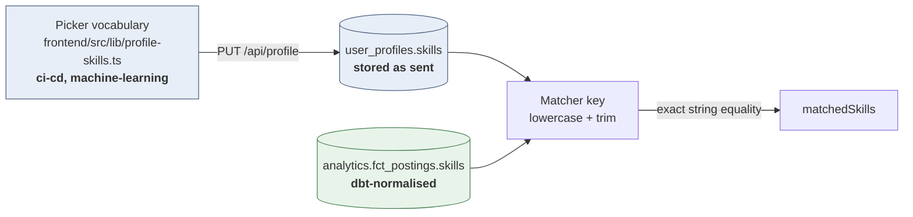
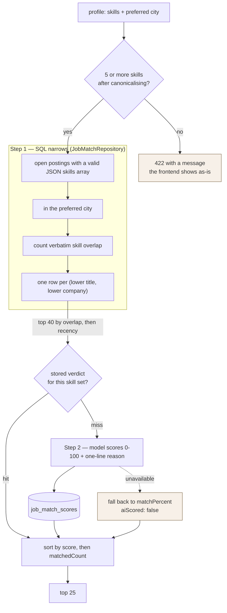

# Profile and matching

These are one document because they are one feature. The profile exists to be matched on: it is the
only input `GET /api/jobs/top-matches` has, and every design decision in it — why skills are a
`text[]`, why there is a five-skill floor, why the stored spelling is kept — is a decision about
matching.

Code: [`profile/`](../src/main/java/nl/hackyourfuture/project/backend/profile) and
[`matching/`](../src/main/java/nl/hackyourfuture/project/backend/matching). Request and response
shapes are in [`api.md`](api.md).

---

## Table of contents

- [1. What the profile holds, and what actually matters](#1-what-the-profile-holds-and-what-actually-matters)
- [2. Skills: three spellings and three normalisations](#2-skills-three-spellings-and-three-normalisations)
- [3. Saving a profile](#3-saving-a-profile)
- [4. How a match is produced](#4-how-a-match-is-produced)
- [5. Reading the response](#5-reading-the-response)
- [6. The score cache](#6-the-score-cache)
- [7. When things degrade](#7-when-things-degrade)
- [8. Configuration](#8-configuration)
- [9. Known gaps](#9-known-gaps)
- [10. Changing it](#10-changing-it)

---

# 1. What the profile holds, and what actually matters

One row per user in `user_profiles`, or none at all until the first save.

| Field | Column | Used by matching? |
| --- | --- | --- |
| `skills` | `skills text[]` | **Yes** — the whole ranking rests on it |
| `preferredCity` | `preferred_city` | **Yes** — the shortlist is restricted to postings in that city |
| `category` | `category` | No |
| `workMode` | `work_mode` | No |
| `experienceLevel` | `experience_level` | No |
| `employmentType` | `employment_type` | No |
| `salaryPreference` | `salary numeric(10,2)` | No |

**Only two of the seven fields reach the matcher.** `JobMatchService` calls
`findTopMatches(profile.getPreferredCity(), skills, 40)` and passes nothing else; the model is sent
skills and job titles, never a preference. The other five are collected, stored, returned, and
included in the data export — but a user who sets `workMode: remote` will still see on-site jobs in
their matches. The city filter used to soften that by letting any `is_remote` posting through
regardless of where it was; it no longer does. Work mode is a work-mode preference and belongs to
`workMode`, not to the city filter, and blending the two made "Amsterdam" return a list that read as
unfiltered. Until `workMode` is honoured, a remote-preferring user with a preferred city set sees
only postings in that city.

That is worth stating plainly because the profile form does not say it, and it is the first thing to
fix if matching is ever tightened. The columns are there, populated, and indexed by nothing — the
work is in the SQL, not in the schema.

Three further columns exist from `V2` and are neither read nor written: `preferred_role`,
`preferred_country`, `education_level`. No form field feeds them.

---

# 2. Skills: three spellings and three normalisations

This is the part that surprises people. A skill passes through three systems, each with its own
idea of what the string should look like.

| Where | Normalisation | Result |
| --- | --- | --- |
| The picker ([`profile-skills.ts`](../../frontend/src/lib/profile-skills.ts)) | A hard-coded vocabulary: ~530 values in 12 categories, lowercase and hyphen-joined | `ci-cd`, `machine-learning`, `spring` |
| `ProfileService` on save | Lowercases and collapses hyphens **and** whitespace runs to a single space — but only to build a **deduplication key**. The spelling that arrived is what is stored | key `ci cd`, stored `ci-cd` |
| `JobMatchService` before matching | Lowercase and trim, nothing else | `ci-cd` |
| dbt ([`int_postings_skills.sql`](../../data/dbt/models/intermediate/int_postings_skills.sql)) | Lowercase, trim, Unicode dashes to `-`, spaces around `-` removed, whitespace collapsed, plus a short alias list (`machine learning` → `machine-learning`, `data science` → `data-science`) | `ci-cd`, `machine-learning` |

The two ends agree because both are hyphen-joined and lowercase, which is why the matcher
deliberately does **not** collapse hyphens the way `ProfileService` does. Collapsing them would turn
`machine-learning` into `machine learning`, which the mart does not contain, and break more matches
than it repairs.

The visible consequence of the mismatch: on the profile screen, `machine-learning` and
`machine learning` are one skill (they share a dedup key, first spelling wins); to the matcher they
are two different strings, and only the hyphenated one will ever match anything.

**Display is a fourth spelling.** `formatProfileSkillLabel` turns `ci-cd` into `CI/CD` and
`sql-server` into `SQL Server` for the UI, via a small exceptions map plus title-casing. Nothing
downstream sees those labels.

**The picker vocabulary is hard-coded, not derived from the mart.** The profile form gets its city,
category, work mode, experience and employment options from `GET /api/jobs/filters` — live values
from the published data — but skills come from the static list in `profile-skills.ts`. That list was
built from the mart, so it agrees with it today, and it will drift the day the pipeline starts
publishing a skill that is not in it. A skill no posting has ever asked for can never match
anything; the backend accepts it regardless, because rejecting against a vocabulary would make the
form unusable the moment the two disagree.

`normalizeProfileSkillsForCompatibility` maps a handful of older title-case values
(`React` → `react`, `Spring Boot` → `spring`) so profiles saved before the vocabulary changed still
light up in the picker.

---

# 3. Saving a profile

`PUT /api/profile` replaces the whole row. `ProfileRepository.save` is a single
`INSERT ... ON CONFLICT (user_id) DO UPDATE ... RETURNING`, so the first save creates the row, there
is no separate POST, and the response is the row **as Postgres stored it** — a salary sent as
`45000` comes back `45000.00`, exactly as a later `GET` returns it.

Two rules do the real work:

**A field left out is cleared.** That is the only way a user can empty something they filled in
before. Blank and whitespace-only values are stored as null, so "cleared" and "never filled in" stay
one state. Note this differs from `PUT /api/users/me`, where a null name leaves the existing one.

**Skills are checked twice.** `UpdateProfileRequest` bounds what was *sent* (5–20 entries, each at
most 100 characters); `ProfileService` bounds what is *stored*, after blanks are dropped and
duplicate keys collapsed. Five entries that normalise to two are a 400 with a message saying so —
without the second check they would be a 200 followed by a 422 from the matcher, which is a much
worse way to find out.

**Why five.** Below that the shortlist query has too little to rank on: overlap counts of 0 and 1
sort almost everything into a tie, and the model is then re-ranking noise. The floor is enforced in
the request DTO, in the service, in the picker, and read back by `JobMatchService`, which uses
`UpdateProfileRequest.MIN_SKILLS` rather than a number of its own — so there is one place to change
it. Twenty is the ceiling because a profile listing everything describes nobody.

A user who has never saved gets an empty profile, not a 404: the screen has to render for a new
account, and the data export must not fail on one.

---

# 4. How a match is produced

## Step 1 — the SQL shortlist

[`JobMatchRepository.findTopMatches`](../src/main/java/nl/hackyourfuture/project/backend/matching/JobMatchRepository.java)
is deliberately dumb. Exact skill-string overlap, nothing else. Synonyms and seniority are the
model's job, and encoding them here is how this query grows unreadable.

| Rule | Detail |
| --- | --- |
| Only open postings | `status = 'open' AND closed_at IS NULL`. Note `/api/jobs` search does **not** filter this way, so a job you can find can be one that can never be matched |
| Only parseable skills | `pg_input_is_valid(skills, 'jsonb')`. The casts below it would throw on a malformed row and take the whole endpoint down with it; this treats that posting as one that simply does not match |
| City | Matched against `fct_postings_cities` — the same resolved city the filter dropdown offers — never the raw location text, where `%Ede%` also matches every "Nederland" posting. Equality on the resolved city and nothing else: a remote posting elsewhere does **not** qualify, which is the same rule `/api/jobs?location=` applies. A blank `preferredCity` means no location filter at all |
| Reposts collapsed | `row_number() OVER (PARTITION BY lower(title), lower(coalesce(company_name,'')))`, keeping the best-overlapping, then freshest, then lowest id. A job posted three times cannot eat three shortlist places |
| No minimum overlap | There is deliberately no `matched_count > 0` filter: a job asking for `postgresql` would never reach a profile saying `postgres`, and rescuing exactly that is what step 2 is for |
| Cut | `ORDER BY cardinality(matched_skills) DESC, posted_date DESC NULLS LAST, posting_id LIMIT 40` |

The matcher reads the `skills` **JSON column on `fct_postings`**, exploded with
`jsonb_array_elements_text`. Job *display* reads the `fct_postings_skills` bridge table instead. Two
representations of the same thing, chosen per use: the matcher wants one row per posting with an
array it can intersect; the API wants a list to render.

## Step 2 — the model rescores

[`MatchScorer`](../src/main/java/nl/hackyourfuture/project/backend/matching/MatchScorer.java) sends
one request for the whole unscored shortlist: the candidate's skills, then one line per job with a
truncated id, the title, and the job's skills. It asks for `0–100` and a reason under twelve words
per job, as a bare JSON array.

- **Nothing about the user goes out.** No name, no email, no city, no id — skills and job titles
  only.
- **Short ids** keep the prompt small and stop the model echoing a 32-character hash back wrongly;
  ids it invents are dropped when the reply is mapped back.
- **The reply is scraped, not trusted.** The parser takes the substring between the first `[` and
  the last `]`, because models wrap JSON in prose or a fence; scores are clamped to 0–100 and
  reasons truncated to 120 characters.
- **`temperature: 0`**, and `reasoning_effort` only when configured — some OpenAI-compatible
  providers reject unknown fields outright, so an empty `LLM_REASONING_EFFORT` leaves it out of the
  body entirely.

The API shape is OpenAI chat-completions, which Gemini's compatibility path and Groq also speak. So
switching provider is `LLM_BASE_URL` + `LLM_MODEL`, not code.

## Assembly

Each shortlist row becomes a `JobMatchResponse` carrying both layers: the SQL's overlap numbers, and
the model's `score` / `reason` / `aiScored`. The list is sorted by `score` descending, ties broken by
`matchedCount`, and cut to **25**.

---

# 5. Reading the response

Two sets of numbers sit side by side, and confusing them is the easiest mistake to make here.

| Field | Comes from | Means |
| --- | --- | --- |
| `matchedSkills` | SQL | The user's skills this job lists **verbatim**. A job matched on `postgresql` will not list the user's `postgres` here, even though the score reflects it |
| `matchedCount` / `ofSkills` | SQL | Size of `matchedSkills`, and how many skills the profile has. `ofSkills` is context for the reader, **not** a denominator |
| `jobSkillCount` | SQL | How many skills the job asks for, and the denominator behind the two below |
| `matchScore` | SQL | `matchedCount / max(jobSkillCount, 5)`, a 0–1 double. Display only |
| `matchPercent` | SQL | The same, rounded. Pair it with `matchedCount` and `jobSkillCount` — "7 of the 8 skills this job asks for" |
| `label` | SQL | `"strong match"` at 60% or above, otherwise null. A badge, never a filter |
| `score` | model, or fallback | 0–100, **and the field the list is ordered by** |
| `reason` | model | One line on why it matches. Null when `aiScored` is false |
| `aiScored` | — | False means this row fell back to the skill-overlap ranking |

**The denominator is the job's skill count, not the user's.** It used to be `ofSkills`, and that
punished the users who filled their profile in best: a posting lists a handful of skills, so a
20-skill profile against an 8-skill job was capped at 40% however perfect the fit, and everything
read as a weak match. Coverage of the job asks the question the candidate actually has — *how much
of what this job wants do I already have?* — and adding a skill can now only ever raise a match.

`max(jobSkillCount, 5)` is the one wrinkle: without a floor, a posting listing a single skill you
happen to have reads 100%, and with no `LLM_API_KEY` that trivial row would sort above a ten-skill
job you cover eight of. Thin postings are common in the mart, so the floor is the ordinary case.
`JobMatchService.MIN_PERCENT_DENOMINATOR` holds it.

**`matchPercent` does not track the order.** The list is sorted by `score`, which sees synonyms and
seniority that exact overlap cannot, so a 100% row can legitimately sit below an 80% one. That is
not a bug to fix in the UI by re-sorting; it is the whole reason the model is there.

The frontend renders `matchPercent`, `matchedCount` and `jobSkillCount` in [`MatchSummary`](../../frontend/src/components/jobs/MatchSummary.tsx),
and shows `reason` only when `aiScored` is true.

---

# 6. The score cache

Verdicts live in `job_match_scores`, keyed on
**(SHA-256 of the sorted lowercased skill set, `posting_id`, `model/promptVersion`)**.

Four properties fall out of that key:

- **Nothing user-identifying is stored.** The hash is of a skill set, not a person. Two users with
  identical skills share rows, and deleting an account leaves nothing behind here — which is why
  the table has no foreign key to `users`.
- **The grain is one posting**, so a returning skill set only pays for what the daily publish added.
- **Changing the model or the prompt invalidates everything for free**, because `scorer_version` is
  `model + "/" + PROMPT_VERSION` and old rows simply stop being found. Bump `PROMPT_VERSION` in
  `MatchScorer` whenever the prompt changes what the numbers mean.
- **Editing a profile costs a rescore.** A different skill set is a different hash, so every save
  makes the next matches request a cold one.

**Freshness is enforced on the read**, not by the purge:
`scored_at > now() - make_interval(days => retention)`. A verdict is therefore never served older
than the window even if the hourly purge is late, misconfigured, or has never run - the purge only
reclaims disk. Retention is clamped to a minimum of one day, because a shorter window would expire
verdicts as fast as they are written and turn every request into a full rescore.

Writes never throw. A failed insert costs one repeated model call later, not an error page for a
ranking the user already has.

---

# 7. When things degrade

Every failure path ends in a usable list. That is the design goal of the split.

| What breaks | What the user sees |
| --- | --- |
| No `LLM_API_KEY` | Skill-overlap order, `aiScored: false`, `score` = `matchPercent`, `reason` null. Logged as a warning at startup |
| Model times out, errors, or returns junk | Same as above, for the rows it did not score. A partly scored list still sorts, because unscored rows fall back to `matchPercent` |
| Provider rejects `reasoning_effort` | Same, and the log carries the provider's response body — without it a config problem reads exactly like an outage |
| Empty mart | `[]`. No error |
| Profile with no row | 422, *"Fill in your profile to see matching jobs."* |
| Profile below five skills | 422 naming the count. Reachable by older profiles even though every current path enforces the floor |
| Posting saved, then dropped by the pipeline | It stops appearing in matches; the saved-jobs list keeps the row with null job fields |

---

# 8. Configuration

| Variable | Default | Effect |
| --- | --- | --- |
| `LLM_API_KEY` | empty | Empty disables step 2 entirely. Everything still works |
| `LLM_BASE_URL` | `https://generativelanguage.googleapis.com/v1beta/openai` | Any OpenAI-compatible chat-completions endpoint |
| `LLM_MODEL` | `gemini-flash-lite-latest` | Part of `scorer_version`, so changing it invalidates stored verdicts |
| `LLM_TIMEOUT_SECONDS` | `20` | Read timeout; connect is fixed at 5s. A cold shortlist takes ~4s on a flash-tier model, so this is headroom, not a target |
| `LLM_REASONING_EFFORT` | `low` | Sent as `reasoning_effort`. Gemini 3 flash costs ~14s without it, ~4s with `low`. Empty omits the field for providers that reject it |
| `LLM_SCORE_RETENTION_DAYS` | `1` | Clamped to a minimum of 1 |
| `LLM_SCORE_PURGE_CRON` | `0 0 * * * *` | Hourly. Only reclaims space, so an expired row lingers at most an hour |

Constants that are code, not configuration, in `JobMatchService`: shortlist size 40, result limit 25,
strong-match threshold 60%.

---

# 9. Known gaps

- **Five of the seven profile fields do not affect matching.** See [section 1](#1-what-the-profile-holds-and-what-actually-matters).
- **The job detail page can only explain a job that is in the top 25.**
  [`JobDetailsMatchSection`](../../frontend/src/components/jobs/JobDetailsMatchSection.tsx) calls
  `top-matches` and looks for the posting by id, so every other job shows no match information at
  all. A per-posting endpoint would fix it; today it is one shortlist or nothing.
- **The picker vocabulary can drift from the mart** — hard-coded list versus published data, with no
  check that they still agree.
- **A zero-overlap posting can enter the shortlist** when there are fewer than 40 with any overlap,
  and the model may then rank it highly on synonyms. Correct behaviour, but it means the shortlist is
  not always "the 40 most relevant" — it is "the 40 best by literal overlap", which is a weaker
  claim.
- **Remote roles are unreachable for a user with a preferred city.** The city filter is strict, and
  nothing reads `workMode`, so a remote posting outside the preferred city cannot appear in matches
  at all. Honouring `workMode` in `findTopMatches` is the fix; until then, clearing the preferred
  city is the only way to see them.
- **One request per shortlist, no batching across users.** Fine at this scale; the cache is what
  keeps it fine.
- **No rate limit on the endpoint**, so nothing bounds how often a user can force a rescore by
  editing their profile. It is the first place a limit should go.

---

# 10. Changing it

| To change | Touch |
| --- | --- |
| Which postings can be matched at all | `findTopMatches`, the `candidate` CTE |
| How the shortlist is ordered or how big it is | `findTopMatches` `ORDER BY`, `SHORTLIST_SIZE` |
| Make a preference actually filter | `findTopMatches` — add the parameter, and pass it from `JobMatchService.getTopMatches` |
| What the model is asked | `MatchScorer.buildPrompt` — **and bump `PROMPT_VERSION`**, or old verdicts scored under the previous prompt will be served alongside new ones |
| The 60% "strong match" line | `JobMatchService.STRONG_MATCH_PERCENT` |
| What `matchPercent` is a percentage *of* | `JobMatchService.jobCoverage`, and `MIN_PERCENT_DENOMINATOR` for the floor under thin postings |
| The five-skill floor | `UpdateProfileRequest.MIN_SKILLS`, which every other place reads |
| The skill vocabulary | `frontend/src/lib/profile-skills.ts`, ideally by re-deriving it from the mart |
