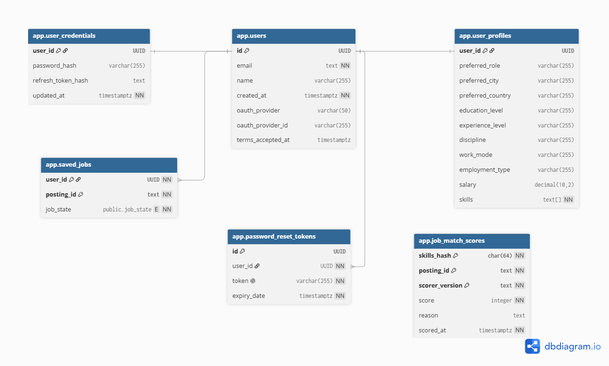
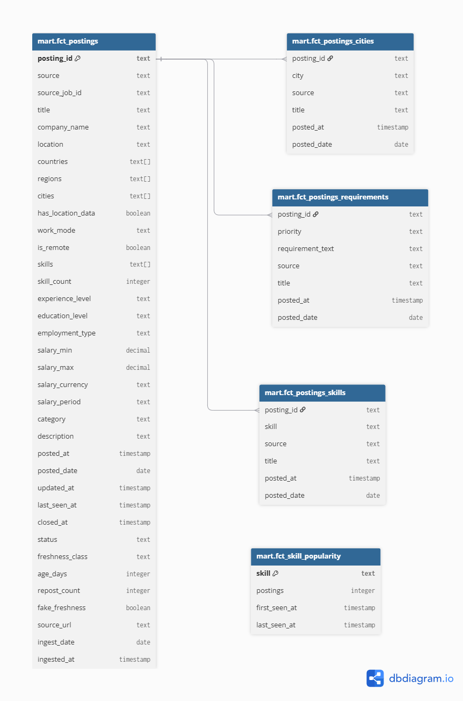

# Database schema

JobMatch runs two separate schemas in the same Postgres database, owned by two different systems.

| Schema | Owned by | Purpose |
| --- | --- | --- |
| `app` | Backend (Flyway migrations in [`db/migration/`](../src/main/resources/db/migration)) | Accounts, profiles, saved jobs — everything the backend writes |
| `analytics` (aka `mart`) | Data pipeline ([`data/dbt/`](../../data/dbt)) | Job postings and derived facts, published daily. The backend only reads it |

The backend never writes to `analytics`, and the pipeline never writes to `app`. The two are joined
in application code, not in SQL — e.g. a saved job's `posting_id` (text) is looked up against
`mart.fct_postings.posting_id` at read time; there is no foreign key across schemas.

---

## `app` schema

| Table | Key | Holds |
| --- | --- | --- |
| `users` | `id` (UUID) | One row per account: email, name, OAuth identity, when terms were accepted |
| `user_credentials` | `user_id` → `users.id` | Password hash, split out from `users` so an OAuth-only account has no row here. Its `refresh_token_hash` column (V2) is unused; refresh tokens live in `refresh_tokens` |
| `user_profiles` | `user_id` → `users.id` | The matching profile — `skills text[]` plus preferences (city, category, work mode, salary, ...). See [`matching-profile.md`](matching-profile.md) for which fields actually affect matching |
| `saved_jobs` | (`user_id`, `posting_id`) | A user's saved postings and their `job_state` (`SAVED` / `APPLIED` / `REJECTED`). `posting_id` is a text reference into the mart, not a foreign key. See [`saving-tracking.md`](saving-tracking.md) |
| `password_reset_tokens` | `id` (UUID) | One-time tokens for the forgot-password flow, with an expiry |
| `refresh_tokens` | `id` (UUID), `user_id` → `users.id` | Refresh tokens, stored as their SHA-256 only, with an expiry and a revocation time. Created by `identity`'s own migration (`db/identity/V1`), and readable by no other module's role. See [`auth.md`](auth.md#8-deleting-the-account) |
| `job_match_scores` | (`skills_hash`, `posting_id`, `scorer_version`) | Cached LLM match verdicts, keyed on a hash of the profile's skill set rather than the user — so identical profiles share a cache entry and nothing user-identifying is stored. See [`matching-profile.md`](matching-profile.md#6-the-score-cache) |

---

## `analytics` / `mart` schema

Published by dbt from [`data/dbt/models/marts/`](../../data/dbt/models/marts). All tables share
`posting_id` — an md5 hash the pipeline derives from source + source job id, stable across daily
publishes.

| Table | Holds |
| --- | --- |
| `fct_postings` | One row per job posting: title, company, salary, description, status, freshness fields, and a `skills` JSON array. The wide table everything else hangs off of |
| `fct_postings_cities` | One row per (posting, resolved city). The only table the backend uses for location filtering — see [`jobs-search.md`](jobs-search.md#3-the-location-problem) for why the raw `location` text on `fct_postings` isn't used directly |
| `fct_postings_skills` | One row per (posting, skill) — a bridge table. Job *display* reads this; the matcher reads the JSON column on `fct_postings` instead. Same data, two shapes, chosen per query |
| `fct_postings_requirements` | One row per (posting, requirement), with a priority |
| `fct_skill_popularity` | One row per skill: how many postings ask for it, first/last seen |

---

## Regenerating the diagrams

Both images are exported from [dbdiagram.io](https://dbdiagram.io). To refresh one, describe the
current tables in DBML, paste into dbdiagram.io, and export as PNG over the existing file.
