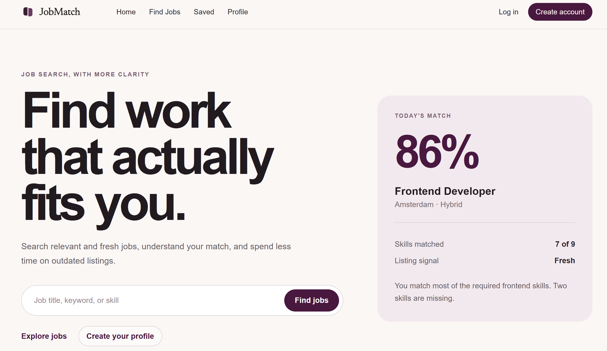
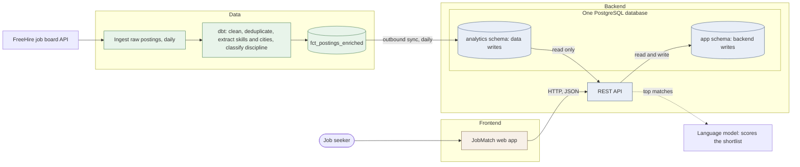

> **Preserved for reference.** This is the README of the original JobMatch monolith, the
> HackYourFuture final project this repository forked to migrate. It describes the product,
> its team and its architecture as they stood at the snapshot commit. The root
> [`README.md`](../README.md) describes the migration experiment being run on top of it.

# JobMatch — HackYourFuture Final Project

This is our final project for the [HackYourFuture program](https://hackyourfuture.net/program), built as a
team with three roles — frontend, backend, and data engineering. We worked in an agile way, in short
sprints, supported by a group of mentors: a Product Manager and a a Tech Lead. The project is open source and available on GitHub.

### 🌐 [Live demo](https://c55c.hyf.dev/)

Create an account and search real job postings, or browse them without signing in. The API reference
is at [c55c.hyf.dev/api/docs](https://c55c.hyf.dev/api/docs).

**Or run the whole stack locally.** Copy `.env.example` to `.env`, start database, API and web app
with Docker, and open [http://localhost:3000](http://localhost:3000):

```bash
cp .env.example .env
scripts/dev-up.sh          # or: docker compose up --build
```

Job listings come from the data pipeline, so a fresh local database shows an empty job list until the
pipeline publishes into it — see [`data/README.md`](../data/README.md).

---

## Table of contents

- [About the project](#about-the-project)
- [Screenshots](#screenshots)
- [Features](#features)
- [Tech stack](#tech-stack)
- [Architecture](#high-level-architecture)
- [Project structure](#project-structure)
- [Documentation](#documentation)
- [CI/CD](#cicd)
- [Team](#team)
- [Roadmap](#roadmap)

---

## About the project

**JobMatch is a job search app for people who are tired of scrolling through listings that are stale,
duplicated, or a bad fit.**

Job boards are noisy. The same role is reposted under three titles, a listing that looks new was
first published months ago, and nothing tells you whether your skills actually line up with what an
employer asks for. Job seekers end up comparing roles by hand and losing track of what they applied
to.

JobMatch narrows that down. A data pipeline collects postings from the [FreeHire](https://freehire.me)
job board every day, cleans them, extracts the skills and locations out of free text, and marks how
fresh a listing really is. The application then lets you search that cleaned set, fill in a profile
with the skills you have, and see your matches ranked and explained — including which required skills
you are still missing. Jobs worth a second look can be saved and tracked through the stages of an
application, from *saved* to *applied* to an offer accepted or declined.

It is built for job seekers, and in particular for career switchers like us, for whom "is this role
realistic for me?" is the expensive question. Matching is decision support: it never claims a job is
right for you, it shows you what it based the score on.

## Screenshots



## Features

- Search jobs by title, keyword, or skill, and filter by category, work mode, and city
- See how fresh a listing is, so reposts and stale ads do not cost you time
- Open a job's full details — description, skills, salary, employment type — and apply on the source site
- Create an account with email and password, or sign in with Google
- Build a profile: your skills, category, preferred city, work mode, experience level, and salary expectation
- Get your top job matches ranked 0–100, each with a short explanation of why it matches
- See your match score on any individual job page
- Save jobs and track each one through *saved*, *applied*, *rejected*, *accepted*, and *declined*
- Review your saved jobs per status, with a count of where your applications stand
- Reset a forgotten password by email, or change the password you have
- Read the terms and privacy policy, and agree to them explicitly before any personal data is stored
- Download everything the app holds about you as a JSON file, or delete your account entirely

## Tech stack

| Layer | Technologies |
| --- | --- |
| **Frontend** | Next.js 16, React 19, TypeScript, Biome |
| **Backend** | Java 25, Spring Boot 4.1, Spring Security (sessions + Google OAuth2), PostgreSQL, Flyway, springdoc-openapi (Scalar), Maven |
| **Data** | Python, SQL, dbt, Databricks (Unity Catalog), Airflow, Azure (Container Apps, ADLS, Key Vault), PostgreSQL |
| **Matching** | Skill-overlap SQL, rescored by an LLM over an OpenAI-compatible API (Gemini by default) |
| **Infrastructure** | Docker, Docker Compose, GitHub Actions, GitHub Container Registry, Azure Container Registry |

## High-level Architecture

Three tracks, three layers, and one database where two of them meet.



The application database holds two schemas. **`analytics`** holds the published job postings: it is
written by the data pipeline and read by the backend. **`app`** holds accounts, profiles, saved jobs
and cached match scores, and only the backend writes it.

Three rules are worth reading off that picture, because they are the ones teams
get wrong:

- **The two schemas have two owners.** The data pipeline writes `analytics` and
  nothing else. The backend writes `app` and nothing else. Neither side has
  permission to write the other's, which is enforced by two database roles
  rather than by everyone remembering.
- **The data track publishes finished tables, not raw material.** `fct_postings` is the contract:
  the backend fills a screen with one `SELECT`, without joining sources or knowing where a row came
  from.
- **User data stays on the application's side.** A profile, a saved job or a match score never
  crosses into the pipeline. Ranking a posting against a user's skills is application logic; it
  happens behind the API.

Matching itself runs in two steps. SQL narrows the postings down to the user's preferred city —
equality on the resolved city, so a remote posting elsewhere does not qualify — and to real skill
overlap, one row per title and company so a reposted job cannot appear twice. That shortlist is then
scored 0–100 by a language model, which is what lets `postgres` match a job asking for `postgresql`.
Verdicts are cached in `job_match_scores`, keyed on the skill set rather than on the user, and
purged on a schedule. If no model is configured the skill-overlap order is returned as it is, and
every row says so.

## Project structure

```
.
├── backend/            Spring Boot REST API (Java, Maven, Flyway)
│   └── docs/           How each feature works, and where it falls short
├── frontend/           Next.js web app (TypeScript, React)
├── data/               Data pipeline (Python, dbt, Airflow)
├── scripts/            Scripts for local development and deployment
├── screenshots/        Images used in this README
├── .github/workflows/  CI/CD pipelines and other workflows
├── docker-compose.yml  The local stack: database, backend, frontend
```

## Documentation

**Start here** — one guide per part of the stack, covering how to run it.

| What | Where |
| --- | --- |
| Frontend guide | [`frontend/README.md`](../frontend/README.md) |
| Backend guide | [`backend/README.md`](../backend/README.md) |
| Data pipeline guide | [`data/README.md`](../data/README.md) |
| Local and deployment scripts | [`scripts/README.md`](../scripts/README.md) |

**How the features work** — one document per feature, written from the code and honest about
what is missing. Each ends with a list of known gaps.

| Feature | Where |
| --- | --- |
| Every endpoint: request, response, status codes, error shapes | [`backend/docs/api.md`](../backend/docs/api.md) |
| Sign-in, sessions, Google OAuth, and the password flows | [`backend/docs/auth.md`](../backend/docs/auth.md) |
| Job search, filters, locations, freshness and the detail page | [`backend/docs/jobs-search.md`](../backend/docs/jobs-search.md) |
| The profile, and how jobs are ranked and scored against it | [`backend/docs/matching-profile.md`](../backend/docs/matching-profile.md) |
| Saving jobs and tracking applications through their stages | [`backend/docs/saving-tracking.md`](../backend/docs/saving-tracking.md) |
| Personal data: what is stored, consent, export and erasure | [`backend/docs/privacy-data.md`](../backend/docs/privacy-data.md) |

**Reference**

| What | Where |
| --- | --- |
| Every environment variable, across all three services | [`backend/docs/configuration.md`](../backend/docs/configuration.md) |
| Both database schemas, their tables, and who owns which | [`backend/docs/schema.md`](../backend/docs/schema.md) |
| The mart the backend reads | [`data/docs/mart_contract.md`](../data/docs/mart_contract.md) |
| Running the pipeline day to day | [`data/docs/dev_flow.md`](../data/docs/dev_flow.md) |
| Live API reference (Scalar) | https://c55c.hyf.dev/api/docs (locally: http://localhost:8080/api/docs) |

**Data marts** — published by dbt under [`data/dbt/models/marts/`](../data/dbt/models/marts/), each with a
`.yml` file naming its columns. `fct_postings_enriched` is the one the backend reads; the rest back
specific filters and stats.

| Mart | Grain | What it's for |
| --- | --- | --- |
| `fct_postings` | One row per posting | Base fact table: the deduplicated, cleaned postings |
| `fct_postings_enriched` | One row per posting, plus discipline | The mart the backend reads |
| `fct_postings_cities` | One row per posting × city | Filtering postings by city |
| `fct_postings_skills` | One row per posting × skill | Filtering postings by skill |
| `fct_postings_requirements` | One row per posting × requirement | Filtering postings by requirement, split into required vs preferred |
| `fct_skill_popularity` | One row per skill | How many postings mention each skill, and when it was first/last seen |
| `fct_title_discipline` *(optional, disabled by default)* | One row per distinct title | LLM-classified discipline, as an alternative to the rule-based one |

## CI/CD

Four GitHub Actions workflows run automatically:

| Workflow | Triggers on | What it does |
| --- | --- | --- |
| [Backend CI/CD](../.github/workflows/backend-ci-cd.yaml) | changes under `backend/**` | Checkstyle, tests, Docker build; pushes the image to GHCR on `main` |
| [Frontend CI/CD](../.github/workflows/frontend-ci-cd.yaml) | changes under `frontend/**` | Lint, build, Docker build; pushes the image to GHCR on `main` |
| [Data CI/CD](../.github/workflows/data-ci-cd.yaml) | changes under `data/**` | Lint, tests, dbt and DAG checks, Docker build; deploys the ingestion job to Azure on `main` |
| [PR checks](../.github/workflows/pr-checks.yml) | every pull request | The description follows the template, and the diff stays under 400 changed lines |

Pull requests are only merged when their checks pass.


## Team

| Name | Role | GitHub |
| --- | --- | --- |
| Hamed Razizadeh | Frontend | [@HamedRazizadeh-hub](https://github.com/HamedRazizadeh-hub) |
| Monerh Al Sqyan | Backend | [@Miuroro](https://github.com/Miuroro) |
| Yusup Rozimemet | Backend | [@Yusuprozimemet](https://github.com/Yusuprozimemet) |
| Halyna Romanyshyn | Data engineering | [@halyna1995](https://github.com/halyna1995) |
| Baraah Alshiaani | Data engineering | [@thebaraah](https://github.com/thebaraah) |
| Mohamad Bader Almsaddi alzin | Data engineering | [@noneeeed](https://github.com/noneeeed) |

## Roadmap

What is designed or wanted but not built yet:

- [ ] Rate limiting on sign-in, profile saves, and the model-backed match endpoint — nothing answers 429 today
- [ ] Let users change the email address they sign in with, which needs a verification flow
- [ ] Serve the data export from the API instead of assembling it in the browser, so it covers everything the database holds
- [ ] Upload a CV and read the skills off it, instead of picking every skill by hand
