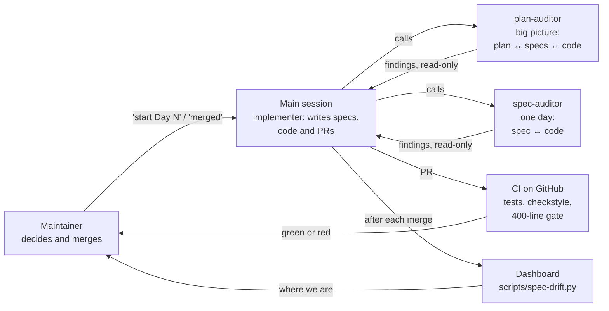
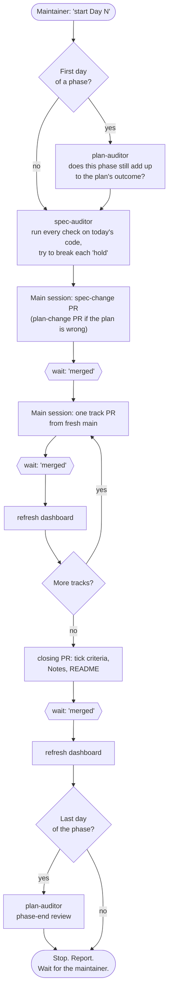

# How the work runs

The rules are in [`CLAUDE.md`](../CLAUDE.md) and [`specs/README.md`](../specs/README.md). This page
draws them: who does what, what triggers what, and how to start.

Three layers have to agree. [`plan.md`](../plan.md) is the goal, and changes rarely. The day specs
in [`specs/`](../specs/) are the steps. The code is where the steps land.

## Who does what

The two auditors ([`.claude/agents/`](../.claude/agents/)) only read and report. They never edit
files or open PRs, which is what keeps them independent from the session that writes the code.

## What triggers what

| Trigger | Runs | Produces |
|---|---|---|
| "start Day N", first day of a phase | plan-auditor, then spec-auditor | findings, then a spec-change or plan-change PR |
| "start Day N", any other day | spec-auditor | findings, then a spec-change PR |
| "merged" | dashboard refresh, then the next track or the closing PR | a PR, then wait |
| a phase's last day closes | plan-auditor, phase-end review | a report; nothing starts until the maintainer says so |
| any time, by hand | either auditor | for example "use the plan-auditor on Phase 3" |

## Starting, for someone new

1. Clone the repository and open Claude Code in it. `CLAUDE.md` and the two agents load on
   their own; there is nothing to install for them.
2. Read `plan.md`, then `specs/README.md`.
3. Run `python scripts/spec-drift.py --out spec-drift.json`, or open the [dashboard](https://yusuprozimemet.github.io/jobmatch-microservices/), for the
   current day and the next step.
4. Say "start Day N". The session follows the order above and stops at every PR.

Three things to know: nothing merges without the maintainer; nothing starts after a phase ends
until they say so; an auditor's findings are advice, and the maintainer decides what becomes a PR.
